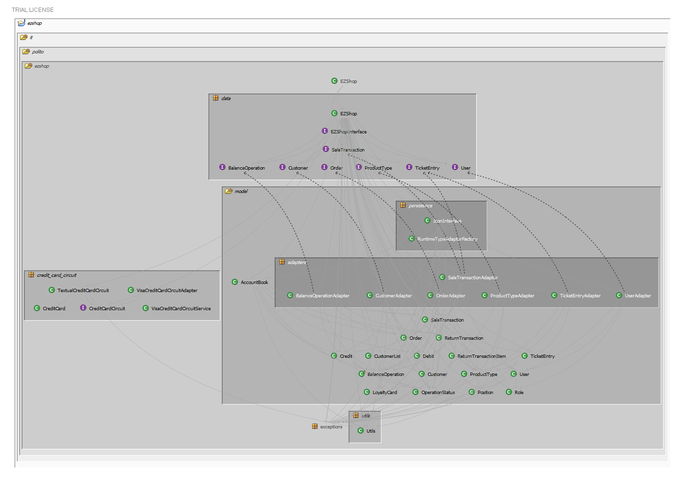
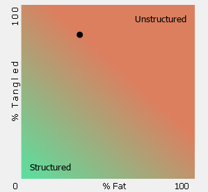
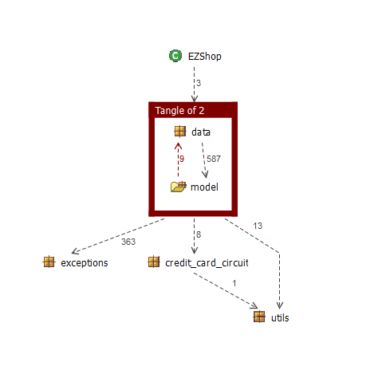

# Design assessment

# Levelized structure map

# Structural over complexity chart

# Size metrics

| Metric                                    | Measure |
| ----------------------------------------- | ------- |
| Packages                                  | 10      |
| Classes (outer)                           | 62      |
| Classes (all)                             | 65      |
| NI (number of bytecode instructions)      | 8617    |
| LOC (non comment non blank lines of code) | 3705    |

# Items with XS

| Item | Tangled | Fat  | Size | XS   |
| ---- | ------- | ---- | ---- | ---- |
| it.polito.ezshop | 1% | 9 | 8617 | 78 |
| it.polito.ezshop.data.EZShop | | 213 | 3033 | 1324 |

# Package level tangles

# Summary analysis

The Design Document delivered on April 30 is comparable with the current structure of the project. We introduced the adapter package to decouple the models implementation from the interfaces required by model interface.
Then we added persistence package in order to keep the JSON interface isolated from the model interface.
Last but not least, we created a utils package to perform some recurrent checks on the validity of ID, BarCodes and Credit Cards.

The structure seems to be reasonable but there is one fat class which embeds a lot of logic. The reason for that is that there's one class that has to implement 50 methods and we tried to bring outside some logic such as AccountBook and CustomerList but it looked to be not enough.
