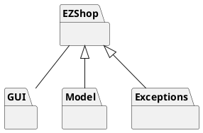

# Design Document


Authors:

Date:

Version:


# Contents

- [High level design](#package-diagram)
- [Low level design](#class-diagram)
- [Verification traceability matrix](#verification-traceability-matrix)
- [Verification sequence diagrams](#verification-sequence-diagrams)

# Instructions

The design must satisfy the Official Requirements document, notably functional and non functional requirements

# High level design

<discuss architectural styles used, if any>
<report package diagram>



# Low level design

<for each package, report class diagram>

```plantuml
left to right direction

interface "EZShopInterface" {
    + reset()
    + createUser(String, String, String)
    + deleteUser(Integer)
    + getAllUsers()
    + getUser(Integer)
    + updateUserRights(Integer, String)
    + login(String, String)
    + logout()
    + createProductType(String, String, double, String)
    + updateProduct(Integer, String, String, double, String)
    + deleteProductType(Integer)
    + getAllProductTypes()
    + getProductTypeByBarCode(String)
    + getProductTypesByDescription(String)
    + updateQuantity(Integer, int)
    + updatePosition(Integer, String)
    + issueReorder(String, int, double)
    + payOrderFor(String, int, double)
    + payOrder(Integer)
    + recordOrderArrival(Integer)
    + getAllOrders()
    + defineCustomer(String)
    + modifyCustomer(Integer, String, String)
    + deleteCustomer(Integer)
    + getCustomer(Integer)
    + getAllCustomers()
    + createCard()
    + attachCardToCustomer(String, Integer)
    + modifyPointsOnCard(String, int)
    + startSaleTransaction()
    + addProductToSale(Integer, String, int)
    + deleteProductFromSale(Integer, String, int)
    + applyDiscountRateToProduct(Integer, String, double)
    + applyDiscountRateToSale(Integer, double)
    + computePointsForSale(Integer)
    + closeSaleTransaction(Integer)
    + deleteSaleTicket(Integer)
    + getSaleTicket(Integer)
    + getTicketByNumber(Integer)
    + startReturnTransaction(Integer)
    + returnProduct(Integer, String, int)
    + endReturnTransaction(Integer, boolean)
    + deleteReturnTransaction(Integer)
    + receiveCashPayment(Integer, double)
    + receiveCreditCardPayment(Integer, String)
    + returnCashPayment(Integer)
    + returnCreditCardPayment(Integer, String)
    + recordBalanceUpdate(double)
    + getCreditsAndDebits(LocalDate, LocalDate)
    + computeBalance()
}

class EZShop {
    + currentUser
}

EZShopInterface <|- EZShop

class JsonInterface {
    + readUsers()
    + writeUsers(List<User>)
    + readProductTypes()
    + writeProductTypes(List<ProductType>)
    + readSaleTransactions()
    + writeSaleTransactions(List<SaleTransaction>)
    + readReturnTransactions()
    + writeReturnTransactions(List<ReturnTransaction>)
    + readAccountBook()
    + writeAccountBook(AccountBook)
}

JsonInterface ---down- EZShop

EZShop -- "*" User : "Map"
EZShop -- AccountBook
EZShop -- "*" SaleTransaction
EZShop -- "*" ReturnTransaction
EZShop -- "*" ProductType

class User {
    + id
    + username
    + passwordHash
    + role
    + verifyPassword(String)
}

class ProductType {
    + id
    + barCode
    + description
    + sellPrice
    + quantity
    + discountRate
    + notes
    + position
}

class Position {
    + aisleID
    + rackID
    + levelID
    + {static} parsePosition(String)
}

ProductType - "0..1" Position

class Order {
    + pricePerUnit
    + quantity
    + status
    + computeTotal()
}

Order "*" - ProductType


class LoyaltyCard {
    + ID
    + points
    + updatePoints(int)
}

class Customer {
    + id
    + name
    + surname
    + loyaltyCard
}

LoyaltyCard "0..1" - Customer


class SaleTransaction {
    + ID
    + ticket
    + date
    + time
    + cost
    + paymentType /' cash or cc '/
    + discountRate
    + status /' open/close '/
    + getAllQuantities() /' Set<Quantity> '/
    + updateQuantity(Quantity)
    + computePoints()
    + closeTransaction()
}

class Quantity {
    + product
    + quantity
    + discountRate
}

SaleTransaction -- "*" Quantity
Quantity "*" -- ProductType

/' (SaleTransaction, ProductType)  .. Quantity '/

SaleTransaction "*" -- "0..1" LoyaltyCard

class ReturnTransaction {
    + id
    + commit
    + returns /' HashSet<ReturnTransactionItem> '/
    + getAllReturns() /' HashSet<ReturnTransactionItem> '/
    + updateReturn(ReturnTransactionItem)
}

class ReturnTransactionItem {
    + quantity
    + returnedValue
}

ReturnTransaction -- "*" ReturnTransactionItem

ReturnTransaction "*" - SaleTransaction
ReturnTransactionItem "*" - ProductType

/'
CreditCard cc = CreditCard.fromCode("xxx");
if (cc != null) {
    // credit card is valid
}'/

/' SaleTransaction - "0..1" CreditCard '/


class AccountBook {
    + transactions
    + recordTransaction(double)
    + recordTransaction(BalanceOperation)
    + getCredits()
    + getSales()
    + getDebits()
    + getReturns()
    + getOrders()
    + checkAvailability(double)
    + computeBalance()
    + addSale(value)
    + addReturn(value)
    + addOrder()
}

class BalanceOperation {
    + id
    + description
    + amount
    + date

}
AccountBook -- "*" BalanceOperation

class Credit
class Debit

Credit --|> BalanceOperation
Debit --|> BalanceOperation

class Order
class Sale
class Return

Order --|> Debit
Sale --|> Credit
Return --|> Debit

SaleTransaction "0..1" --  Sale
ReturnTransaction -- Return

interface CreditCardCircuit {
    + init()
    + validateCode(creditCardCode)
    + checkAvailability(creditCardCode, amount)
    + addDebit(creditCardCode, amount)
    + addCredit(creditCardCode, amount)
}

EZShop - CreditCardCircuit

class TextualCreditCardCircuit {
    + readFromFile(String)
    + writeToFile(String)
}

class CreditCard {
    + code
    + balance
    + checkAvailability (amount)
    + updateBalance (amount)
}

CreditCard "*" --left- TextualCreditCardCircuit

class VisaCreditCardCircuitAdapter {}

TextualCreditCardCircuit --down-|> CreditCardCircuit
VisaCreditCardCircuitAdapter --down-|> CreditCardCircuit

class VisaCreditCardCircuitService {
    + authenticate()
    + ...
}

VisaCreditCardCircuitAdapter - VisaCreditCardCircuitService : "adaptees"


```


# Verification traceability matrix

\<for each functional requirement from the requirement document, list which classes concur to implement it>
| Function | Store Manager | Shop Worker | Customer | Anonymous Customer | Accountant | Supplier |
| ------------- |:-------------|--|--|--|--|--|
| FR1 | yes | no | no | no | no | no |
| FR2 | yes | yes | no | no | no | no |
| FR3 | yes | yes | yes | yes | no | no |
| FR4 | yes | yes | no | no | no | no |
| FR5   | yes | no | no | no | yes | no |
| FR6   | yes | no | no | no | yes | no |
| FR7.1   | yes | yes | no | no | no | yes |
| FR7.2   | no | no | no | no | no | yes |
| FR7.3   | yes | yes | no | no | no | no |
| FR7.4   | yes | yes | no | no | no | no |
| FR8   | yes | no | no | no | no | no |


# Verification sequence diagrams
\<select key scenarios from the requirement document. For each of them define a sequence diagram showing that the scenario can be implemented by the classes and methods in the design>

## Scenario 1.1: Create product type X
```plantuml

StoreManager -> EZShopGUI: Create Product type
EZShopGUI -> EZShop: CreateProductType()
EZShop -> ProductType: New ProductType
ProductType-->EZShop: Save New ProductType
EZShop -->EZShopGUI: Success
EZShopGUI --> StoreManager: Created New Product Type
```
## Scenario 2.1: Create user and define rights
```plantuml
Administrator -> EZShopGUI: Create User
EZShopGUI -> EZShop: CreateUser()
EZShop -> User: New User
User-->EZShop: Save New User
EZShop -->EZShopGUI: Success
EZShopGUI --> Administrator: Created New User
```

## Scenario 3.2: Order of product type X payed

```plantuml

StoreManager -> EZShopGUI: Show all orders
EZShopGUI -> EZShop: getAllOrders()
EZShop -> AccountBook: getOrders()
AccountBook -> AccountBook: Filter orders among transactions
AccountBook --> EZShop: Return orders
EZShop --> EZShopGUI: Return orders
EZShopGUI --> StoreManager: Show orders
StoreManager -> EZShopGUI: Select an order O
EZShopGUI -> EZShop: payOrderFor()
EZShop -> Order: computeTotal()
Order --> EZShop: Total is returned
EZShop -> AccountBook: checkAvailability()
AccountBook -> AccountBook: computeBalance()
AccountBook --> EZShop: Balance is enough
EZShop -> Order: setStatus()
Order --> EZShop: Order is in PAYED state
EZShop --> EZShopGUI: Success
EZShopGUI --> StoreManager: Successful message

```

## Scenario 4.2: Attach Loyalty card to customer record

```plantuml
StoreManager -> EZShopGUI: Show all customers
EZShopGUI -> EZShop: getAllCustomers()
EZShop --> EZShopGUI: Return the list of customers
EZShopGUI --> StoreManager: Show the list of customers
StoreManager -> EZShopGUI: Select a customer Cu
EZShopGUI -> EZShop: createNewCard()
EZShop --> EZShopGUI: Return card's id
EZShopGUI -> EZShop: attachCardToCustomer()
EZShop -> Customer: setLoyaltyCard()
Customer --> EZShop: Card is assigned
EZShop --> EZShopGUI: Card is assigned
EZShopGUI --> StoreManager: Successful message

```

## Scenario 8.1: Return transaction of product type X completed, credit card

```plantuml

Cashier -> EZShopGUI: inserts ticket number
EZShopGUI -> EZShop: startReturnTransaction()
EZShop -> ReturnTransaction: returnTransaction()
ReturnTransaction -> EZShop: return returnTransaction
EZShop -> EZShopGUI: return transactionId
EZShopGUI -> Cashier : show transaction
Cashier -> EZShopGUI: scan barcodes
EZShopGUI -> EZShop: returnProduct
EZShop -> ReturnTransaction: updateReturn()
EZShop -> ProductType: updateQuantity()
EZShopGUI -> Cashier: show transaction
 -> : 
Cashier -> EZShopGUI: end transaction
EZShopGUI -> EZShop: endReturnTransaction()
EZShop -> ReturnTransaction: endTransaction()
EZShop -> AccountBook: computeBalance()


```

## Scenario 9.1: List credits and debits

```plantuml

StoreManager -> EZShopGUI: Selects a start date
StoreManager -> EZShopGUI: Selects a end date
EZShopGUI -> EZShop: getCreditsAndDebits()
EZShop -> AccountBook: recordTransaction()
AccountBook -> AccountBook: filter transactions of selected time-span
AccountBook -> EZShop: Return transactions_list
EZShop -> EZShopGUI: Return transactions_list
EZShopGUI -> StoreManager: Shows the transactions list

```
## Scenario 10.1: Return payment by  credit card

```plantuml

Cashier -> EZShopGUI: enters credit card number
EZShopGUI -> EZShop: returnCreditCardPayment()
EZShop -> CreditCardCircuit: validateCreditCardNumber()
CreditCardCircuit -> CreditCardCircuit: validateCode()
CreditCardCircuit -> EZShop: approves
EZShop -> EZShopGUI: askReturnAmount()
EZShopGUI -> Cashier: ask return amount
Cashier -> EZShopGUI: enter return amount
EZShopGUI -> EZShop: recordBalanceUpdate()
EZShop -> EZShopGUI: Return return_amount
EZShopGUI -> Cashier: shows success massage

```
