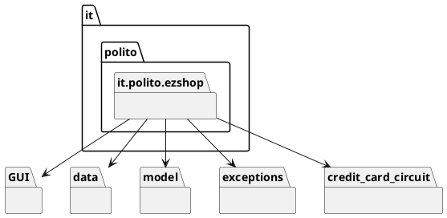

# Design Document


Authors: Can Karacomak (s287864), Alessandro Loconsolo (s244961), Julian Neubert (s288423), Simone Alberto Peirone (s286886)

Date: 30/04/2021

Version: 1.0


# Contents

- [High level design](#package-diagram)
- [Low level design](#class-diagram)
- [Verification traceability matrix](#verification-traceability-matrix)
- [Verification sequence diagrams](#verification-sequence-diagrams)

# Instructions

The design must satisfy the Official Requirements document, notably functional and non functional requirements

# High level design

<discuss architectural styles used, if any>
<report package diagram>



# Low level design

<for each package, report class diagram>
```plantuml
interface "EZShopInterface" {
    + reset()
    + createUser(String, String, String)
    + deleteUser(Integer)
    + getAllUsers()
    + getUser(Integer)
    + updateUserRights(Integer, String)
    + login(String, String)
    + logout()
    + createProductType(String, String, double, String)
    + updateProduct(Integer, String, String, double, String)
    + deleteProductType(Integer)
    + getAllProductTypes()
    + getProductTypeByBarCode(String)
    + getProductTypesByDescription(String)
    + updateQuantity(Integer, int)
    + updatePosition(Integer, String)
    + issueReorder(String, int, double)
    + payOrderFor(String, int, double)
    + payOrder(Integer)
    + recordOrderArrival(Integer)
    + getAllOrders()
    + defineCustomer(String)
    + modifyCustomer(Integer, String, String)
    + deleteCustomer(Integer)
    + getCustomer(Integer)
    + getAllCustomers()
    + createCard()
    + attachCardToCustomer(String, Integer)
    + modifyPointsOnCard(String, int)
    + startSaleTransaction()
    + addProductToSale(Integer, String, int)
    + deleteProductFromSale(Integer, String, int)
    + applyDiscountRateToProduct(Integer, String, double)
    + applyDiscountRateToSale(Integer, double)
    + computePointsForSale(Integer)
    + closeSaleTransaction(Integer)
    + deleteSaleTicket(Integer)
    + getSaleTicket(Integer)
    + getTicketByNumber(Integer)
    + startReturnTransaction(Integer)
    + returnProduct(Integer, String, int)
    + endReturnTransaction(Integer, boolean)
    + deleteReturnTransaction(Integer)
    + receiveCashPayment(Integer, double)
    + receiveCreditCardPayment(Integer, String)
    + returnCashPayment(Integer)
    + returnCreditCardPayment(Integer, String)
    + recordBalanceUpdate(double)
    + getCreditsAndDebits(LocalDate, LocalDate)
    + computeBalance()
}
```
```plantuml

package it.polito.ezshop.data {
interface EZShopInterface {
}

note "This the provided EZShopInterface interface" as n

n -down- EZShopInterface

class EZShop {
    + currentUser
}

EZShopInterface <|-- EZShop

class JsonInterface {
    + readUsers()
    + writeUsers(List<User>)
    + readProductTypes()
    + writeProductTypes(List<ProductType>)
    + readBalanceOperations()
    + writeBalanceOperations(List<BalanceOperation>)
    + readAccountBook()
    + writeAccountBook(AccountBook)
}

JsonInterface ---right- EZShop

EZShop -right- "*" User
EZShop -- AccountBook
EZShop -down--- "*" ProductType

class User {
    + ID
    + username
    + passwordHash
    + role
    + verifyPassword(String)
    + setRole(String)
}

enum Role {
    ADMINISTRATOR
    CASHIER
    SHOP_MANAGER
}

User -up- Role

class ProductType {
    + ID
    + barCode
    + description
    + sellPrice
    + quantity
    + discountRate
    + notes
    + updateQuantity(int)
    + updatePosition(String)
}

class Position {
    + aisleID
    + rackID
    + levelID
    + {static} parsePosition(String)
}

ProductType - "0..1" Position

class Order {
    + pricePerUnit
    + quantity
    + delivered
    + computeTotal()
}

Order "*" -down- ProductType


class LoyaltyCard {
    + cardCode
    + points
    + updatePoints(int)
}

class Customer {
    + ID
    + name
}

EZShop -down- "*" Customer

LoyaltyCard "0..1" -up- Customer


class SaleTransaction {
    + ticket
    + time
    + paymentType /' cash or cc '/
    + discountRate
    + addReturnTransaction()
    + updateSaleTransactionItem(String, int)
    + getTransactionItems()
    + addSaleTransactionItem(SaleTransactionItem)
    + computePoints()
    + closeTransaction()
}

class SaleTransactionItem {
    + product
    + quantity
    + unitPrice
    + discountRate
}

SaleTransaction -right- "*" SaleTransactionItem

/' (SaleTransaction, ProductType)  .. SaleTransactionItem  '/

SaleTransaction "*" -up- "0..1" LoyaltyCard

SaleTransactionItem "*" -up- ProductType

class ReturnTransaction {
    + startReturnTransaction(Integer)
    + addProduct(String, int)
    + getTransactionItems()
    + endReturnTransaction(Integer, boolean)
}

class ReturnTransactionItem {
    + quantity
    + returnedValue
}

ReturnTransaction -down- "*" ReturnTransactionItem

ReturnTransaction "*" -up- SaleTransaction
ReturnTransactionItem "*" -right- ProductType

class AccountBook {
    + addTransaction(BalanceOperation)
    + getTransactions(LocalDate, LocalDate)
    + removeTransaction(int)
    + getCredits()
    + getSaleTransactions()
    + updateSaleTransaction(Integer)
    + getDebits()
    + getReturnTransactions()
    + getOrders()
    + checkAvailability(double)
    + computeBalance()
}

enum OperationStatus {
    OPEN
    CLOSED
    PAYED
}

class BalanceOperation {
    + ID
    + description
    + amount
    + date
    + status
}

BalanceOperation -left- OperationStatus
AccountBook -down- "*" BalanceOperation

class Debit
class Credit

Debit -up-|> BalanceOperation
Credit -up-|> BalanceOperation

class Order

Order -up-|> Debit

SaleTransaction -up-|> Credit
ReturnTransaction -up-|> Debit
}

package it.polito.ezshop.credit_card_circuit {
    interface CreditCardCircuit {
        + init()
        + validateCode(creditCardCode)
        + checkAvailability(creditCardCode, amount)
        + addDebit(creditCardCode, amount)
        + addCredit(creditCardCode, amount)
    }

    CreditCardCircuit <-right- EZShop

    class TextualCreditCardCircuit {
        + path
        - readFromFile()
        - writeToFile()
    }

    class CreditCard {
        + code
        + balance
        + checkAvailability (amount)
        + updateBalance (amount)
    }

    CreditCard "*" -up- TextualCreditCardCircuit

    class VisaCreditCardCircuitAdapter {}

    TextualCreditCardCircuit -up-|> CreditCardCircuit
    VisaCreditCardCircuitAdapter -up-|> CreditCardCircuit

    class VisaCreditCardCircuitService {
        + authenticate()
        + ...
    }

    VisaCreditCardCircuitService <-up- VisaCreditCardCircuitAdapter : "adaptees"
}

```

## Credit card circuit
The *it.polito.ezshop.credit_card_circuit* implements the interaction between the EZShop and the credit card circuit using the Adapter pattern. The *CreditCardCircuit* interface defines the methods for charging and crediting a credit card. The interface is implemented by the *TextualCreditCardCircuit* class that simulates the credit card circuit using a textual file as described in the requirements document.

The *VisaCreditCardCircuitService* implements the Visa Merchant Benchmark REST API v1. The *VisaCreditCardCircuitAdapter* class adapts the Visa service according to the EZShop's interface *CreditCardCircuit*.


# Verification traceability matrix

\<for each functional requirement from the requirement document, list which classes concur to implement it>
| | EZShopInterface | JsonInterface | User | ProductType | SaleTransactionItem | Customer | FidelityCard | CreditCardCircuit | SaleTransaction | ReturnTransaction |Credit | Debit | AccountBook |
| :--: |:--:|:--:|:--:|:--:|:--:|:--:|:--:|:--:|:--:|:--:|:--:|:--:|:--:|
| FR1 | X | X | X | | | |
| FR3 | X | X | X | X | | |
| FR4 | X | X | X | X | | |
| FR5 | X | X | X | | | X | X |
| FR6 | X | X | X | X | X | X | X | | X | X | | |
| FR7 | X | X | X | X | X | X | | X | X | X | X | X |
| FR8 | X | X | X | | | | | | | |X  | X | X |


# Verification sequence diagrams
\<select key scenarios from the requirement document. For each of them define a sequence diagram showing that the scenario can be implemented by the classes and methods in the design>

## Scenario 1.1: Create product type X
```plantuml

StoreManager -> EZShopGUI: Create Product type
EZShopGUI -> EZShop: CreateProductType()
EZShop -> ProductType: New ProductType
ProductType-->EZShop: Save New ProductType
EZShop -->EZShopGUI: Success
EZShopGUI --> StoreManager: Created New Product Type
```
## Scenario 2.1: Create user and define rights
```plantuml
Administrator -> EZShopGUI: Create User
EZShopGUI -> EZShop: CreateUser()
EZShop -> User: New User
User-->EZShop: Save New User
EZShop -->EZShopGUI: Success
EZShopGUI --> Administrator: Created New User
```

## Scenario 3.2: Order of product type X payed

```plantuml

StoreManager -> EZShopGUI: Show all orders
EZShopGUI -> EZShop: getAllOrders()
EZShop -> AccountBook: getOrders()
AccountBook -> AccountBook: Filter orders among transactions
AccountBook --> EZShop: Return orders
EZShop --> EZShopGUI: Return orders
EZShopGUI --> StoreManager: Show orders
StoreManager -> EZShopGUI: Select an order O
EZShopGUI -> EZShop: payOrderFor()
EZShop -> Order: computeTotal()
Order --> EZShop: Total is returned
EZShop -> AccountBook: checkAvailability()
AccountBook -> AccountBook: computeBalance()
AccountBook --> EZShop: Balance is enough
EZShop -> Order: setStatus()
Order --> EZShop: Order is in PAYED state
EZShop --> EZShopGUI: Success
EZShopGUI --> StoreManager: Successful message

```

## Scenario 4.2: Attach Loyalty card to customer record

```plantuml
StoreManager -> EZShopGUI: Show all customers
EZShopGUI -> EZShop: getAllCustomers()
EZShop --> EZShopGUI: Return the list of customers
EZShopGUI --> StoreManager: Show the list of customers
StoreManager -> EZShopGUI: Select a customer Cu
EZShopGUI -> EZShop: createNewCard()
EZShop --> EZShopGUI: Return card's id
EZShopGUI -> EZShop: attachCardToCustomer()
EZShop -> Customer: setLoyaltyCard()
Customer --> EZShop: Card is assigned
EZShop --> EZShopGUI: Card is assigned
EZShopGUI --> StoreManager: Successful message

```

## Scenario 5.1: Login

```plantuml
"Cashier" -> "EZShopGUI": enter username
"Cashier" -> "EZShopGUI": enter password
"EZShopGUI" -> "EZShop": login()
"EZShopGUI" <-- "EZShop": return success
"Cashier" <-- "EZShopGUI": show available functionalities
```

## Scenario 6.4: Sale of product type X with Loyalty Card update

```plantuml
"Cashier" -> "EZShopGUI": start transaction
"EZShopGUI" -> "EZShop": startSaleTransaction()
"EZShop" -> "SaleTransaction": SaleTransaction()
"EZShop" <-- "SaleTransaction": return SaleTransaction
"EZShopGUI" <-- "EZShop": return transactionId
"Cashier" <-- "EZShopGUI": show transaction
"Cashier" -> "EZShopGUI": scan barcode
"Cashier" -> "EZShopGUI": enter amount
"EZShopGUI" -> "EZShop": addProductToSale(transactionId)
"EZShop" -> "SaleTransaction": addProduct()
"EZShop" <-- "SaleTransaction": return success
"EZShopGUI" <-- "EZShop": return success
"Cashier" <-- "EZShopGUI": show transaction
"Cashier" -> "EZShopGUI": end transaction
"EZShopGUI" -> "EZShop": closeSaleTransaction()
"EZShop" -> "SaleTransaction": closeTransaction()
"EZShop" <-- "SaleTransaction": return success
"EZShopGUI" <-- "EZShop": return success
"EZShopGUI" -> "EZShop": computePointsForSale(transactionId)
"EZShop" -> "SaleTransaction": computePoints()
"EZShop" <-- "SaleTransaction": return points
"EZShopGUI" <-- "EZShop": return points
"Cashier" <-- "EZShopGUI": ask payment type
"Cashier" -> "EZShopGUI": scan loyalty card
"EZShopGUI" -> "EZShop": modifyPointsOnCard(points)
"EZShop" -> "LoyaltyCard": addPoints(points)
"EZShop" <-- "LoyaltyCard": return success
"EZShopGUI" <-- "EZShop": return success

note over Cashier, LoyaltyCard
handle payment (Use Case 7)
end note

"Cashier" -> "EZShopGUI": print sale ticket
"Cashier" <-- "EZShopGUI": print ticket
```

## Scenario 7.1: Manage payment by valid credit card

```plantuml
"Cashier" -> "EZShopGUI": 1: read credit card number
"EZShopGUI" -> "EZShop": 2: receiveCreditCardPayment(transactionId)
"EZShop" -> "CreditCardCircuit": 2: validateCard()
"EZShop" -> "CreditCardCircuit": 2: checkBalance()
"EZShop" -> "CreditCardCircuit": 2: addCredit()
"EZShopGUI" <-- "EZShop": 2: return payment success
"Cashier" <-- "EZShopGUI": 1: show payment succeeded
```

## Scenario 8.2: Return transaction of product type X completed, cash

```plantuml

Cashier -> EZShopGUI: inserts transaction ID
EZShopGUI -> EZShop: startReturnTransaction()
EZShop -> ReturnTransaction: startReturnTransaction()
ReturnTransaction --> EZShop: return returnTransaction
EZShop --> EZShopGUI: return transactionId
EZShopGUI --> Cashier : show transaction
Cashier -> EZShopGUI: scan barcodes
EZShopGUI -> EZShop: returnProduct()
EZShop -> ReturnTransaction: addProduct()
EZShop -> ProductType: updateQuantity()
EZShopGUI --> Cashier: show transaction

note over Cashier, AccountBook
Manage credit card return  (go to UC 10 )
end note

EZShopGUI --> Cashier: return successful
Cashier -> EZShopGUI: end transaction
EZShopGUI -> EZShop: endReturnTransaction()
EZShop -> ReturnTransaction: endReturnTransaction()
EZShop -> AccountBook: updateSaleTransaction()
EZShop -> AccountBook: computeBalance()


```

## Scenario 9.1: List credits and debits

```plantuml

StoreManager -> EZShopGUI: Selects a start date
StoreManager -> EZShopGUI: Selects an end date
EZShopGUI -> EZShop: getCreditsAndDebits()
EZShop -> AccountBook: recordTransaction()
AccountBook -> AccountBook: filter transactions of selected time-span
AccountBook -> EZShop: Return transactionsList
EZShop -> EZShopGUI: Return transactionsList
EZShopGUI -> StoreManager: Shows the transactions list

```
## Scenario 10.1: Return payment by  credit card

```plantuml

Cashier -> EZShopGUI: enters credit card number
EZShopGUI -> EZShop: returnCreditCardPayment()
EZShop -> CreditCardCircuit: validateCode()
CreditCardCircuit --> EZShop: return success
EZShop --> EZShopGUI: return success
EZShopGUI -> Cashier: ask return amount
Cashier -> EZShopGUI: enter return amount
EZShopGUI -> EZShop: recordBalanceUpdate()
Ezshop -> CreditCard: updateBalance()
EZShop -> EZShopGUI: Return returned amount
EZShopGUI -> Cashier: shows success massage

```
