# Graphical User Interface Prototype  

Authors:

Date:

Version:

## Cash register GUI
The cash register graphical user interface runs on a fullscreen web page. The interface is meant to be used on a touchscreen display.

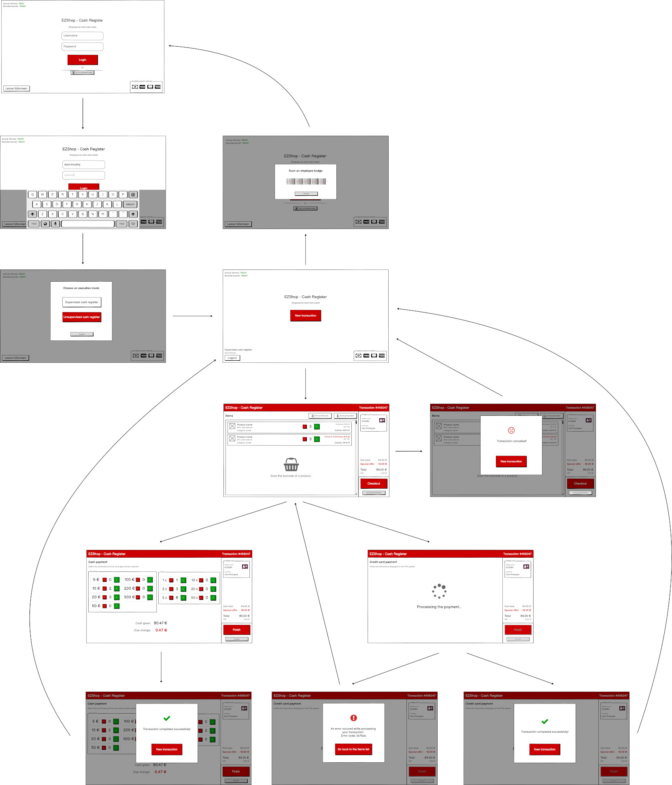

### Authentication screen
The initial screen requires the authentication of a shop worker. The application offers two different login methods: **username+password** or **badge**.

The *Leave fullscreen* button exits the fullscreen mode without additional prompts. 

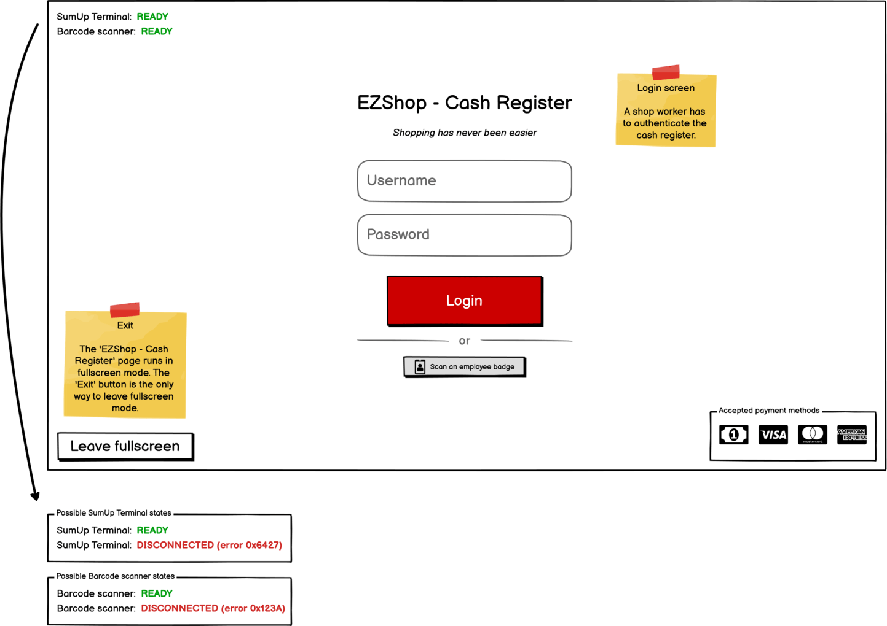
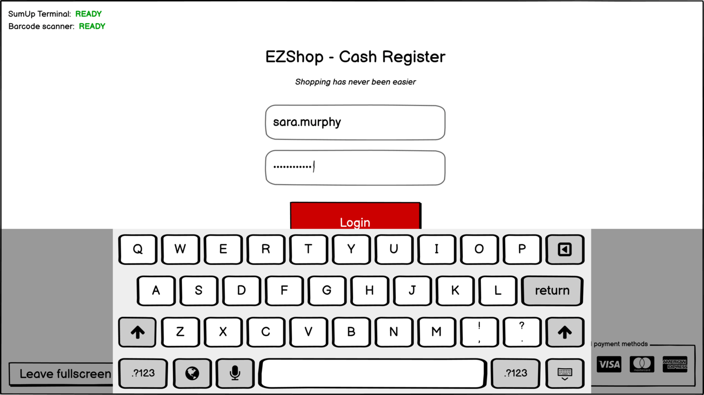

#### Employee badge
The shop worker can authenticate the cash register by scanning his badge with the barcode reader. The following image shows a possible employee badge.

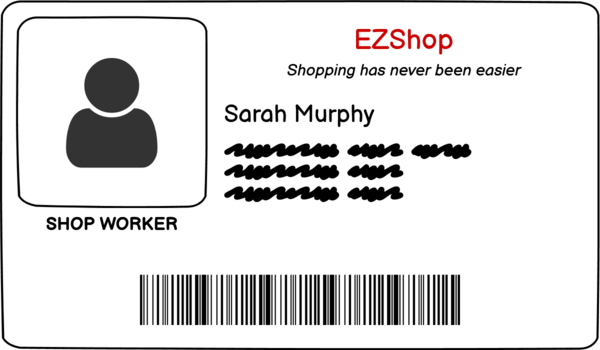

#### Selection of the execution mode
After the authentication procedure is completed, the shop worker can select an execution mode for the cash register. In the **supervised** mode, the cash register is meant to be used by the shop worker. All payments methods are available, cash included. The **unsupervised** allows customers to autonomously complete the checkout process. The cash payment method is disabled.

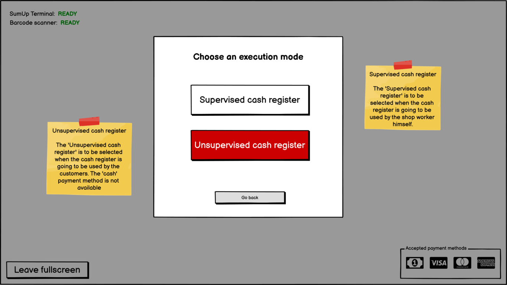

### Idle screen
In the idle screen, the behaviour of the *Logout* button depends on the execution mode. In the supervised mode, the *Logout* redirects the GUI to the login screen. In unsupervised mode, the *Logout* button requires the shop worker to scan a badge before logging out.

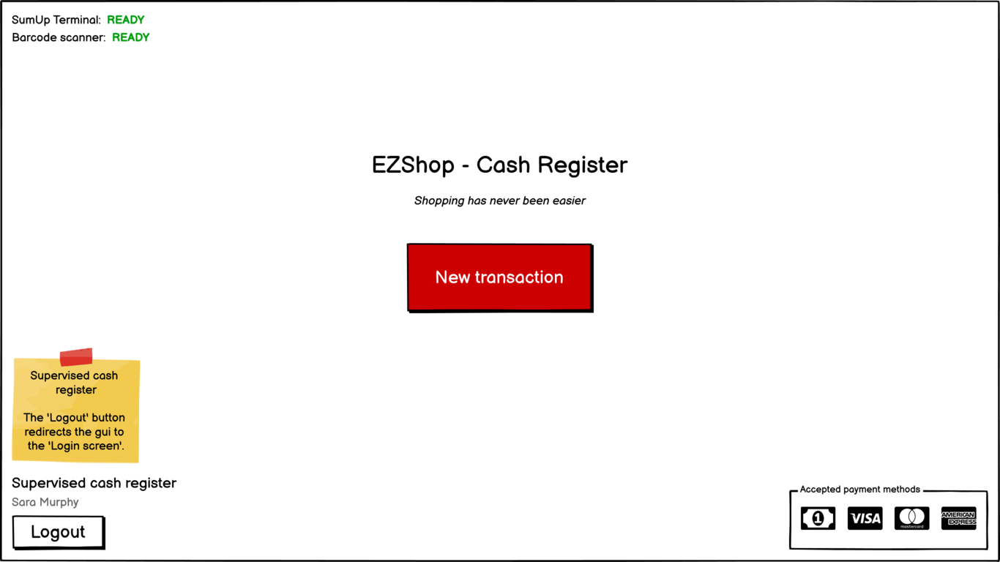
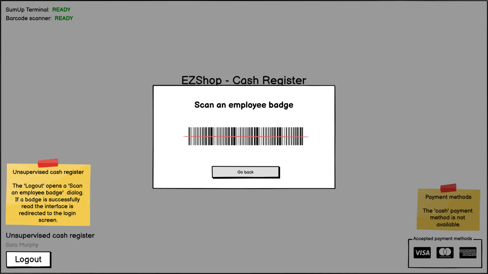

### Items screen
The items screen shows the items included in the transaction. The *shop worker*/*customer* can attach a new product to the transaction by scanning its barcode. 
The system computes the subtotal, vat and total of the transaction in a realtime fashion.

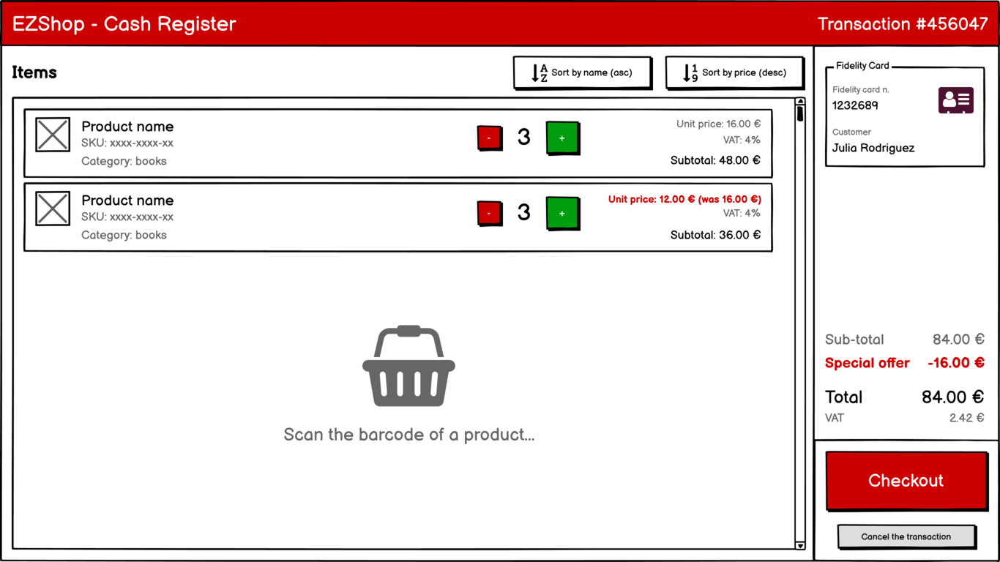

In the supervised mode, the shop worker can cancel the transaction by pressing the dedicated button in the bottom right corner. In the unsupervised mode, the customer can not cancel the transaction autonomously. If the button is pressed, the application requires a badge authentication of the shop worker.

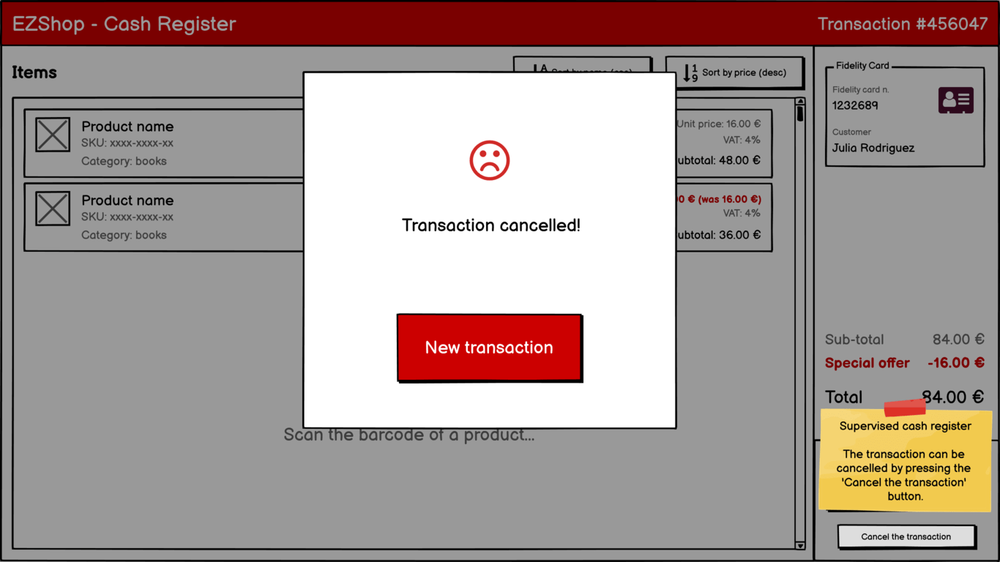

### Checkout process
By pressing the *Checkout* button, the application shows a dialog to select the payment method. In the unsupervised mode, the *cash* method is not available.

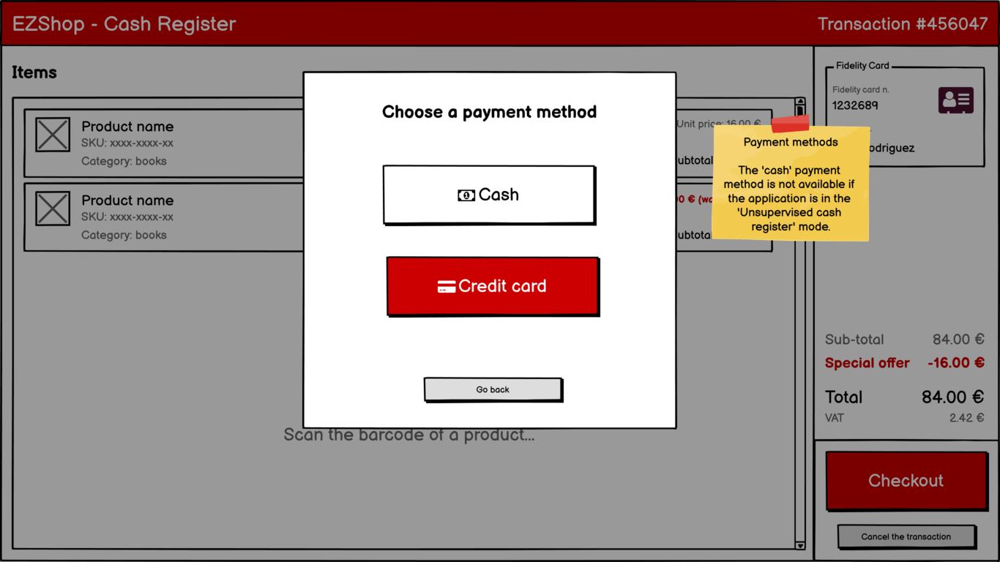

#### Cash payment
The change computation screen allows the shop worker to enter the banknotes and coins given by the customer. Then, the application computes the due change.

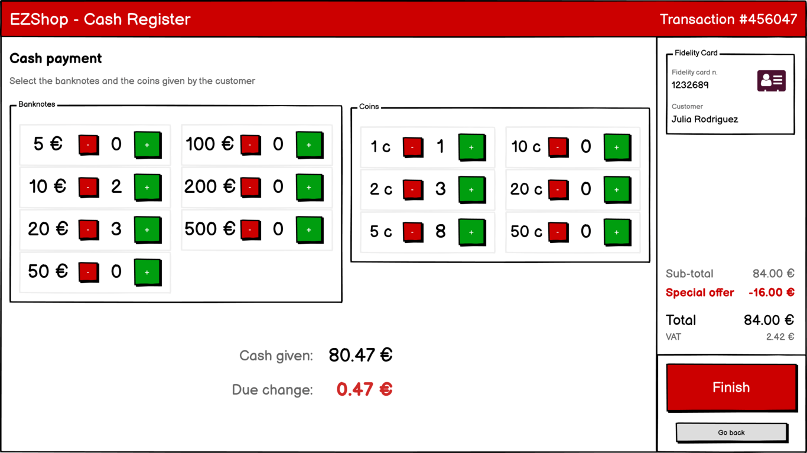

##### Cash payment success

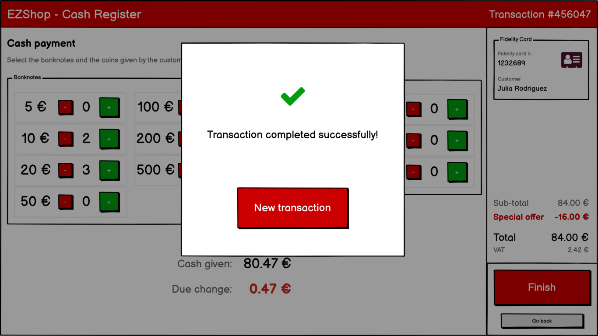

#### Credit card payment
During the credit card payment process, the application shows a *processing* message. The payment flow is delegated to the SumUp terminal.

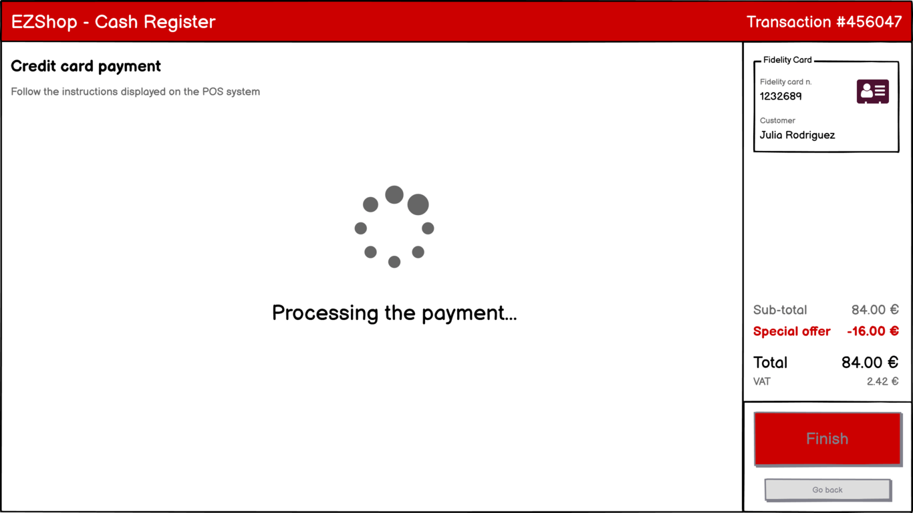

##### Credit card payment failure

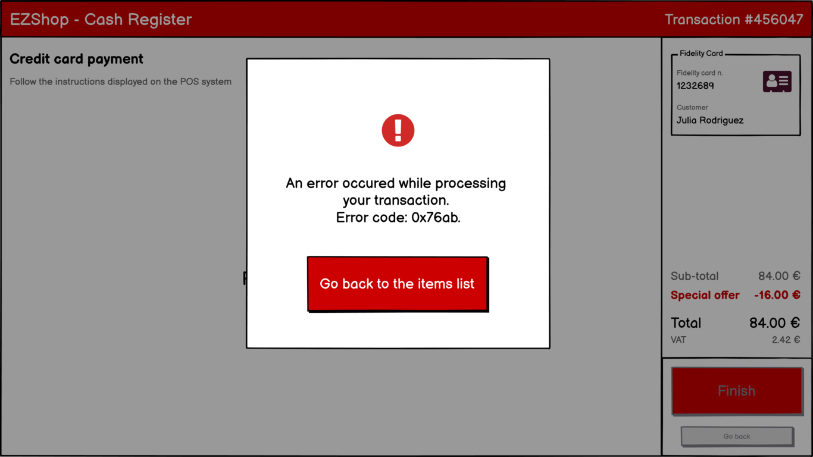

##### Credit card payment success

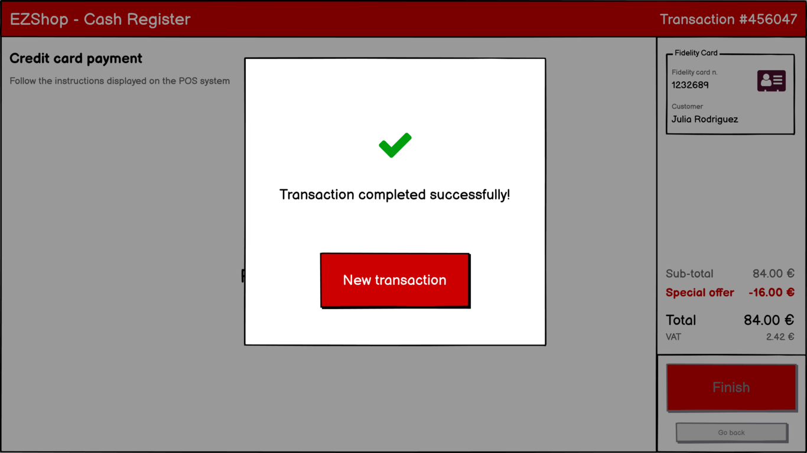