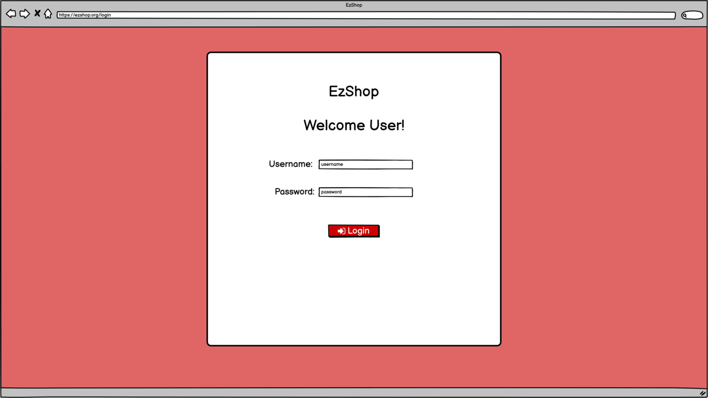
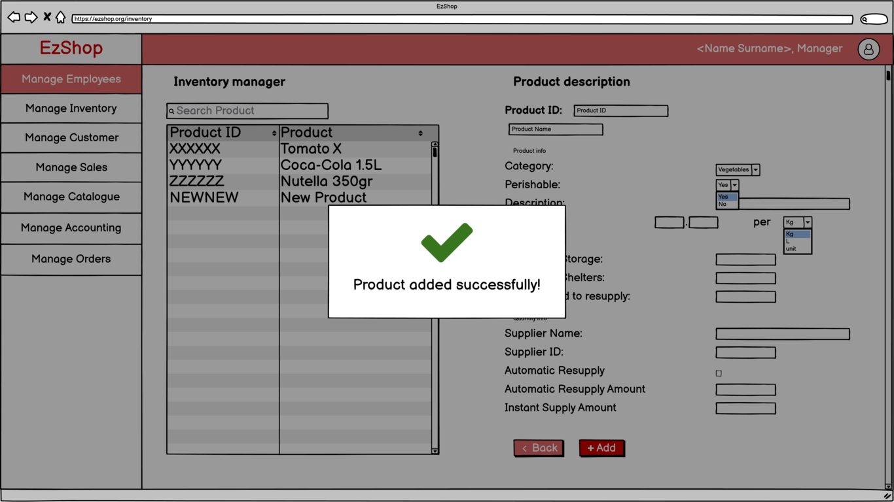
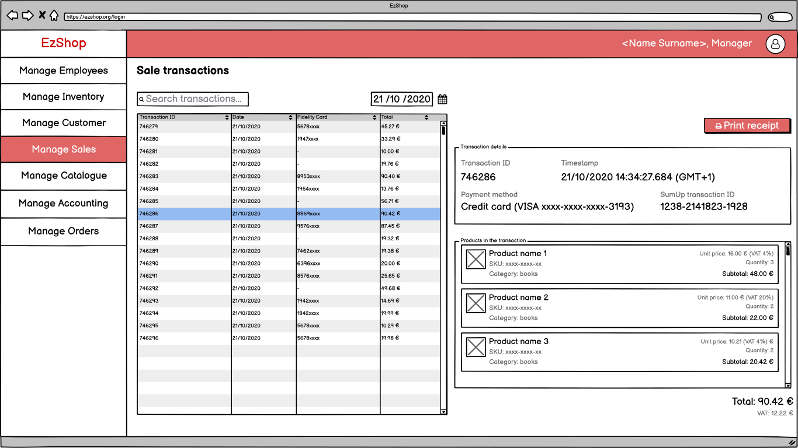
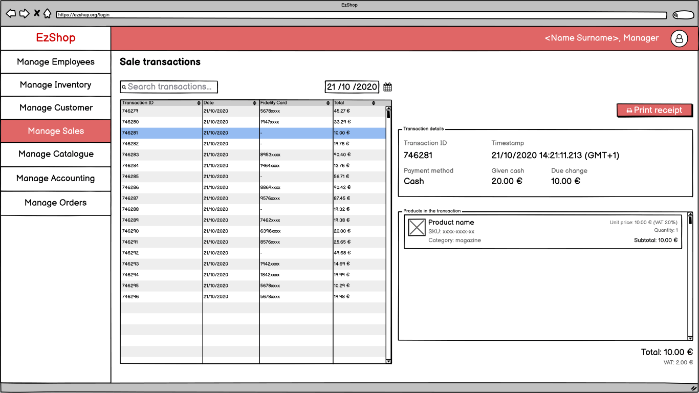

# Graphical User Interface Prototype  

Authors: Can Karacomak (s287864), Alessandro Loconsolo (s244961), Julian Neubert (s288423), Simone Alberto Peirone (s286886)

Date: 21/04/2021

Version: 1.0

## Web GUI
After the login screen, the user is able to reach the different screens of the application, depending on its role (shop worker, store manager and accountant) as specified in the requirements document. The store manager has full access to all the screens.

The storyboard reported below shows the possible interactions for the store manager role.

### Login screen

### Homepage
The homepage shows the personal informations of the user.

### Employees
The application lets the store manager add, edit and remove employees.

#### Add an employee
The store manager adds a new employee by selecting its role (accountant or shop worker) and enters its personal informations.

#### Edit an employee

#### Delete an employee
In order to delete an employee, a confirmation is required.

### Inventory

#### Add a product

##### Confirm insert

##### Insertion confirmed

#### Edit a product

##### Confirm update

##### Update confirmed

#### Resupply
A shop worker can manually increase the amount of a product pending resupply.

##### Resupply confirmed

### Sales
The sales screen shows the transactions history of the shop.

#### Sales list with details
For each transaction, the application shows the items belonging to the transaction and, the payment method and the possibly the POS transaction id. The shop worker can print again the receipt. 

If the transaction was paid in cash, the application shows the cash amount given by the customer and the due change.

#### Example of a receipt
The receipt of EZShop lists the products purchased in the transaction along with their price and quantity. A barcode representing the transaction's id is also reported.

### Customers

#### Add a new customer

#### Edit a customer

#### Delete a customer

### Catalogue
The catalogue interface allows to manage products in the inventory from a the point of view of sales. The store manager can define prices and special offers for each product. Special offers can be tied to fidelity cards.

#### Products list with details

#### Edit a product

##### Confirm update

##### Update confirmed

### Accounting
The accounting section lists incomes and expenses of the shop. The EZShop application tracks sales, orders and generic expenses (salaries, bill, etc...). Generic expenses can be inserted manually in the system.

#### Main screen

#### Expenses

##### Add an expense

##### Edit an expense

#### Incomes
The application shows the incomes and expenses of the shop with a *by product* or *by category* granularity. The store manager can also select a specific time window or filter the result by a text query.

##### Products 

##### Categories

### Suppliers

#### Create a new delivery
The application allows the supplier to read the products pending a resupply. For each product in the list, the supplier can specify the amount that is going to be shipped to the shop in the new delivery.

#### Edit a delivery
The supplier can list the incomplete deliveries and change the amount of each product.

#### Confirm a delivery
When a delivery is received by the shop, the store manager can confirm its receiption and update the quantities in the inventory.

## Cash register GUI
The cash register graphical user interface runs on a fullscreen web page. The interface is meant to be used on a touchscreen display.

### Authentication screen
The initial screen requires the authentication of a shop worker. The application offers two different login methods: **username+password** or **badge**.

The *Leave fullscreen* button exits the fullscreen mode without additional prompts. 

#### Employee badge
The shop worker can authenticate the cash register by scanning his badge with the barcode reader. The following image shows a possible employee badge.

#### Selection of the execution mode
After the authentication procedure is completed, the shop worker can select an execution mode for the cash register. In the **supervised** mode, the cash register is meant to be used by the shop worker. All payments methods are available, cash included. The **unsupervised** allows customers to autonomously complete the checkout process. The cash payment method is disabled.

### Idle screen
In the idle screen, the behaviour of the *Logout* button depends on the execution mode. In the supervised mode, the *Logout* redirects the GUI to the login screen. In unsupervised mode, the *Logout* button requires the shop worker to scan a badge before logging out.

### Items screen
The items screen shows the items included in the transaction. The *shop worker*/*customer* can attach a new product to the transaction by scanning its barcode. 
The system computes the subtotal, vat and total of the transaction in a realtime fashion.

In the supervised mode, the shop worker can cancel the transaction by pressing the dedicated button in the bottom right corner. In the unsupervised mode, the customer can not cancel the transaction autonomously. If the button is pressed, the application requires a badge authentication of the shop worker.

### Checkout process
By pressing the *Checkout* button, the application shows a dialog to select the payment method. In the unsupervised mode, the *cash* method is not available.

#### Cash payment
The change computation screen allows the shop worker to enter the banknotes and coins given by the customer. Then, the application computes the due change.

##### Cash payment success

#### Credit card payment
During the credit card payment process, the application shows a *processing* message. The payment flow is delegated to the SumUp terminal.

##### Credit card payment failure

##### Credit card payment success

