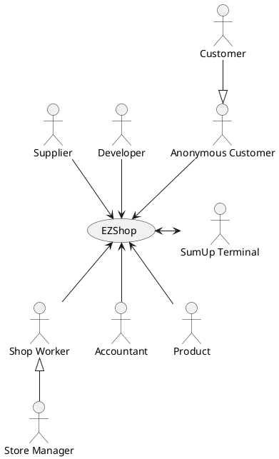

# Requirements Document

Authors: Can Karacomak (s287864), Alessandro Loconsolo (s244961), Julian Neubert (s288423), Simone Alberto Peirone (s286886)

Date: 21/04/2021

Version: 1.0

# Contents

- [Essential description](#essential-description)
- [Stakeholders](#stakeholders)
- [Context Diagram and interfaces](#context-diagram-and-interfaces)
	+ [Context Diagram](#context-diagram)
	+ [Interfaces](#interfaces)
- [Stories and personas](#stories-and-personas)
- [Functional and non functional requirements](#functional-and-non-functional-requirements)
	+ [Functional Requirements](#functional-requirements)
	+ [Non functional requirements](#non-functional-requirements)
- [Use case diagram and use cases](#use-case-diagram-and-use-cases)
	+ [Use case diagram](#use-case-diagram)
	+ [Use cases](#use-cases)
    	+ [Relevant scenarios](#relevant-scenarios)
- [Glossary](#glossary)
- [System design](#system-design)
- [Deployment diagram](#deployment-diagram)

# Essential description

Small shops require a simple application to support the owner or manager. A small shop (ex a food shop) occupies 50-200 square meters, sells 500-2000 different item types, has one or a few cash registers
EZShop is a software application to:
* manage sales
* manage inventory
* manage customers
* support accounting


# Stakeholders

| Stakeholder name  | Description |
| ----------------- |:-----------:|
| Store manager | Manages store, can insert, modify and delete users and products. |
| Accountant | Views expenses and income, can manage products on sale and prices. |
| Shop worker | Registers sales and updates stock levels. |
| Supplier | Views reorder needs of shop and updates stock levels upon delivery. |
| Anonymous customer | A customer of the shop not associated with a fidelity card. |
| Customer | A customer of the shop associated with a fidelity card. |
| Developer | Maintains application and receives license payments. |
| SumUp Terminal | POS system that processes credit card payments. |
| Product | An item stored in the shop's inventory that may be for sale. |

# Context Diagram and interfaces

## Context Diagram



## Interfaces
| Actor | Logical Interface | Physical Interface  |
| ------------- |:-------------:| -----:|
| Manager, Accountant          | Web GUI         | Screen, Keyboard, Mouse on PC |
| Shop Worker                  | Web GUI         | Cash Register, Screen, Keyboard, Mouse on PC |
| Supplier                     | Web GUI         | Screen, Keyboard, Mouse on PC |
| Anonymous Customer, Customer | Web GUI         | Touchscreen display of the automatic cash register |
| Customer                     | Fidelity card   | Barcode scanner |
| Product                      | Barcode         | Barcode scanner |
| SumUp Terminal               | API provided by the [SumUp SDK](https://developer.sumup.com/docs/terminal-overview/) | [Web bluetooth API](https://developer.mozilla.org/en-US/docs/Web/API/Web_Bluetooth_API) |
| Developer                    | -               | Remote access (ssh) to the production server for deployments |

# Stories and personas

Sarah is 45 and is the manager of a small grocery shop. She desires to replace those bulky cash registers from the past with a modern solution that can run on commercial off-the-shelf computers equipped with a touch screen display. Periodically Sarah defines special offers for specific products or categories. She wants to track all the sales transaction in an (almost) real-time fashion from her office.

Eric is 33 and is an accountant. He needs to periodically generate reports of all the incomes and expenses of the shops he supervises. Reports include the final balance of the shop for the selected timeframe and the amount of the Value Added Tax (VAT) due to the income revenue authority.

Julia is 27 and is the head of a supplying company that supplies goods to many local shops. She needs an interface for querying the inventory of the shops and generate resupply claim for products that have a low inventory level. When products are delivered to the shop, a shop worker flags the resupply claim as approved, completing the process.

Laura is 36 and is a shop worker in a local shop. She mainly works at the cashier and maintains the inventory of the shop. When a batch of goods is delivered to the shop she approves the resupply claim and updates the inventory level. She desires to define product categories according to the applied VAT and the type of the product. She also needs to flag products that are stored in the warehouse but not available for sale.

Marco is 35 and is a full-time office worker. He is always in a hurry, so he prefers to use the automatic cash register for his daily grocery shopping whenever possible. Also, he doesn't like to bring banknotes and coins along, so he only pays with his credit card.

# Functional and non functional requirements

## Functional Requirements

| ID           | Description  |
| ------------ |:-------------|
|  **FR1**     | **Manage rights** |
|  FR1.1       | Add an employee |
|  FR1.2       | List all employees |
|  FR1.3       | Edit an employee |
|  FR1.4       | Delete an employee |
|  FR1.5       | Authenticate and authorize an employee |
|  **FR2**     | **Manage inventory** |
|  FR2.1       | Insert a new product |
|  FR2.2       | Update a product |
|  FR2.3       | Remove a product |
|  FR2.4       | List products |
|  FR2.5       | Category management |
|  FR2.5.1     | Create/Update a category |
|  FR2.5.2     | Assign a product to a category |
|  FR2.5.3     | Delete a category |
|  FR2.5.4     | List categories |
|  FR2.5.5     | Show products associated with a category |
|  FR2.6       | Bind a product to a supplier |
|  FR2.7       | Change the resupply amount |
|  **FR3**     | **Sales management** |
|  FR3.1       | Start a transaction |
|  FR3.2       | Add or delete products to the transaction |
|  FR3.3       | Cancel a running transaction |
|  FR3.4       | Add a payment method |
|  FR3.5       | Apply discount and special offers, possibly depending on the fidelity card |
|  FR3.6       | Complete checkout and print receipt |
|  FR3.7       | Keep transaction informations |
|  **FR4**     | **Manage customers** |
|  FR4.1       | Define a new customer, or modify an existing one |
|  FR4.2       | Create a fidelity card for the customer |
|  FR4.3       | Delete a customer |
|  FR4.4       | Search a customer |
|  **FR5**     | **Manage catalogue** |
|  FR5.1       | List the catalogue entries |
|  FR5.2       | Update a catalogue entry |
|  FR5.3       | Remove a catalogue entry |
|  FR5.4       | Define a special offer |
|  **FR6**     | **Manage accounting** |
|  FR6.1       | Add an expense |
|  FR6.2       | Compute balance |
|  **FR7**     | **Manage orders** |
|  FR7.1       | Show the order list for the supplier |
|  FR7.2       | Create a new delivery |
|  FR7.3       | List all deliveries for the supplier |
|  FR7.4       | Accepts a delivery |
|  **FR8**     | **Manage supplier** |
|  FR8.1       | Insert a supplier |
|  FR8.2       | List all suppliers |
|  FR8.3       | Update a supplier |
|  FR8.4       | Delete supplier |


### Access right, actor vs function

| Function | Store Manager | Shop Worker | Customer | Anonymous Customer | Accountant | Supplier |
| ------------- |:-------------|--|--|--|--|--|
| FR1 | yes | no | no | no | no | no |
| FR2 | yes | yes | no | no | no | no |
| FR3 | yes | yes | yes | yes | no | no |
| FR4 | yes | yes | no | no | no | no |
| FR5   | yes | no | no | no | yes | no |
| FR6   | yes | no | no | no | yes | no |
| FR7.1   | yes | yes | no | no | no | yes |
| FR7.2   | no | no | no | no | no | yes |
| FR7.3   | yes | yes | no | no | no | no |
| FR7.4   | yes | yes | no | no | no | no |
| FR8   | yes | no | no | no | no | no |


## Non Functional Requirements

| ID        | Type | Description  | Refers to |
| ------------- |:-------------:| :-----:| -----:|
|  NFR1     | Privacy  | Ensure customer data are stored safely and can't be accessed by non authorized users. | All FR |
|  NFR2     | Privacy | The system complies with local privacy law requirements (GDPR in Europe). | All FR |
|  NFR4     | Reliability | The software should be able to correctly update the inventory level in any situation (even if an error occurs) | All FR |
|  NFR5     | Portability | The application is accessible from any modern browser. The integration with the SumUp terminal is restricted to Chrome 56+ and Edge 79+ due to the compatibility with the Web Bluetooth API required to communicate with the POS terminal.  | All FR |
|  NFR6     | Security | All the users of the systems should be authenticated and no information should be visible to the outside. | All FR |
|  NFR7     | Performance |  The application should complete operations in less than 1 second. | All FR |
|  NFR8     | Maintainability | The application should be always up to date with law requirements and security standards | All FR |
|  NFR9     | Usability | The application should be used with no specific training. | All FR |

# Use case diagram and use cases

## Use case diagram
```plantuml
"Store manager" as StoreManager
(Manage access rights) as FR1
(Add an employee) as UC1.1
(List all employees) as UC1.2
(Edit an employee) as UC1.3
(Delete an employee) as UC1.4
(Authenticate and authorize an employee) as UC1.5

FR1 ..> UC1.1 :include
FR1 ..> UC1.2 :include
FR1 ..> UC1.3 :include
FR1 ..> UC1.4 :include
FR1 ..> UC1.5 :include

UC1.1 <- StoreManager
UC1.2 <- StoreManager
UC1.3 <- StoreManager
UC1.4 <- StoreManager
UC1.5 <- StoreManager

```

```plantuml
"Shop worker" as ShopWorker

(Manage inventory) as FR2
(Category management) as UC2.5

(Insert a new product) as UC2.1
(Update a product) as UC2.2
(Remove a product) as UC2.3
(List products) as UC2.4
(Create/Update a category) as UC2.5.1
(Assign a product to a category) as UC2.5.2
(Delete a category) as UC2.5.3
(List categories) as UC2.5.4
(Show products associated with a category) as UC2.5.5
(Bind a product to a supplier) as UC2.6
(Change the resupply amount) as UC2.7


/' Inventory management (UC2.1, UC2.2, UC2.3, UC2.4, UC2.5, UC2.6, UC2.7) '/
FR2 ...> UC2.1 :include
FR2 ...> UC2.2 :include
FR2 ....> UC2.3 :include
FR2 ....> UC2.4 :include
FR2 ....> UC2.5 :include
FR2 ....> UC2.6 :include
FR2 ....> UC2.7 :include

/' Category management (UC2.5.1, UC2.5.2, UC2.5.3, UC2.5.4, UC2.5.5) '/
UC2.5 ....> UC2.5.1 :include
UC2.5 ....> UC2.5.2 :include
UC2.5 ....> UC2.5.3 :include
UC2.5 ....> UC2.5.4 :include
UC2.5 ....> UC2.5.5 :include

UC2.1 <-- ShopWorker
UC2.2 <-- ShopWorker
UC2.3 <-- ShopWorker
UC2.4 <-- ShopWorker
UC2.5.1 <-- ShopWorker
UC2.5.2 <-- ShopWorker
UC2.5.3 <-- ShopWorker
UC2.5.4 <-- ShopWorker
UC2.5.5 <-- ShopWorker
UC2.6 <-- ShopWorker
UC2.7 <-- ShopWorker
```

```plantuml
"Anonymous Customer, Customer, Shop Worker" as ACCSW
"SumUp Terminal" as SumUpTerminal
"Product" as Product

(Sales management) as FR3

(Start a transaction) as UC3.1
(Add or delete products to the transaction) as UC3.2
(Cancel a running transaction) as UC3.3
(Add a payment method) as UC3.4
(Apply discount and special offers) as UC3.5
(Complete checkout and print receipt) as UC3.6
(Keep transaction informations) as UC3.7

/' Sale transactions management (UC3.1, UC3.2, UC3.3, UC3.4, UC3.5, UC3.6, UC3.7,) '/
FR3 ..> UC3.1 :include
FR3 ..> UC3.2 :include
FR3 ..> UC3.3 :include
FR3 ..> UC3.4 :include
FR3 ..> UC3.5 :include
FR3 ..> UC3.6 :include
FR3 ..> UC3.7 :include

UC3.1 <-- ACCSW
UC3.2 <-- ACCSW
UC3.3 <-- ACCSW
UC3.4 <-- ACCSW
UC3.5 <-- ACCSW
UC3.6 <--> ACCSW
UC3.7 <-- ACCSW

UC3.6 <--> SumUpTerminal

UC3.2 <-- Product
```


```plantuml
"Shop Worker" as ShopWorker

(Manage customers) as FR4

(Define a new customer, or modify an existing one) as UC4.1
(Create a fidelity card for the customer) as UC4.2
(Delete a customer) as UC4.3
(Search a customer) as UC4.4

/' Customers management (UC4.1, UC4.2, UC4.3, UC4.4,) '/
FR4 ..> UC4.1 :include
FR4 ..> UC4.2 :include
FR4 ..> UC4.3 :include
FR4 ..> UC4.4 :include

UC4.1 <-- ShopWorker
UC4.2 <-- ShopWorker
UC4.3 <-- ShopWorker
UC4.4 <-- ShopWorker
```

```plantuml
"Accountant" as Accountant

(Manage catalogue) as FR5

(List the catalogue entries) as UC5.1
(Update a catalogue entry) as UC5.2
(Remove a catalogue entry) as UC5.3
(Define a special offer) as UC5.4

/' Customers management (UC5.1, UC5.2, UC5.3, UC5.4,) '/
FR5 ..> UC5.1 :include
FR5 ..> UC5.2 :include
FR5 ..> UC5.3 :include
FR5 ..> UC5.4 :include

UC5.1 <-- Accountant
UC5.2 <-- Accountant
UC5.3 <-- Accountant
UC5.4 <-- Accountant

```


```plantuml
"Accountant" as Accountant

(Manage accounting) as FR6

(Add an expense) as UC6.1
(Compute balance) as UC6.2

/' Manage accounting (UC6.1, UC6.2) '/
FR6 ..> UC6.1 :include
FR6 ..> UC6.2 :include

UC6.1 <-- Accountant
UC6.2 <-- Accountant
```

```plantuml
"Supplier" as Supplier
"Shop Worker" as ShopWorker

(Manage orders) as FR7

/' Orders management (UC7.1, UC7.2, UC7.3, UC7.4) '/
(Show the order list for the supplier) as UC7.1
(Create a new delivery) as UC7.2
(List all deliveries for the supplier) as UC7.3
(Accepts a delivery) as UC7.4

FR7 ..> UC7.1 :include
FR7 ..> UC7.2 :include
FR7 ..> UC7.3 :include
FR7 ..> UC7.4 :include

UC7.1 <-- ShopWorker
UC7.1 <-- Supplier
UC7.2 <-- Supplier
UC7.3 <-- ShopWorker
UC7.4 <-- ShopWorker

```


```plantuml
"Store manager" as StoreManager

(Manage suppliers) as FR8

(Insert a supplier) as UC8.1
(List all suppliers) as UC8.2
(Update a supplier) as UC8.3
(Delete a supplier) as UC8.4

/' Supplier management (UC8.1, UC8.2, UC8.3, UC8.4) '/
FR8 ..> UC8.1 :include
FR8 ..> UC8.2 :include
FR8 ..> UC8.3 :include
FR8 ..> UC8.4 :include

UC8.1 <-- StoreManager
UC8.2 <-- StoreManager
UC8.3 <-- StoreManager
UC8.4 <-- StoreManager
```

### Use case 1, UC1 - Insert an employee
| Actors Involved  | Store manager |
| ---------------- |:-------------:|
| Precondition     | - |  
| Post condition   | An employee E (shop worker or accountant) is created. |
| Nominal Scenario | A new employee E is created successfully. |
| Variants         | An employee with the same ssn code already exists. |

##### Scenario 1.1
| Scenario 1.1     | A new employee E is created successfully. |
| ---------------- |:-------------:|
| Precondition     | - |
| Post condition   | An employee E (shop worker or accountant) is created. |
| Step#  | Description  |
| 1      | The store manager enters the properties of the new employee E and its role (shop worker or accountant). |
| 2      | Employee E is created. |

##### Scenario 1.2
| Scenario 1.2     | An employee with the same ssn code already exists. |
| ---------------- |:-------------:|
| Precondition     | - |
| Post condition   | - |
| Step#  | Description  |
| 1      | The store manager enters the properties of the new employee E and its role (shop worker or accountant). |
| 2      | An employee with the same ssn code already exists. An error is raised and the operation is aborted. |


### Use case 2, UC2 - List all employees
| Actors Involved  | Store manager |
| ---------------- |:-------------:|
| Precondition     | - |  
| Post condition   | A list of employees is shown. |
| Nominal Scenario | Filter and list the employees. |
| Variants         | - |

##### Scenario 2.1
| Scenario 2.1     | Filter and list the employees |
| ----------------- |:-------------:|
| Precondition      | - |
| Post condition    | A list of employees is shown. |
| Step#  | Description  |
| 1      | The actor possibly enters a text query. |
| 2      | The application shows a list of employees, possibly filtering the names based on the provided query. |


### Use case 3, UC3 - Update an employee
| Actors Involved  | Store manager |
| ---------------- |:-------------:|
| Precondition     | The application is showing a list of employees including E. |
| Post condition   | Employee E is updated. |
| Nominal Scenario | Employee E is updated successfully. |
| Variants         | - |

##### Scenario 3.1
| Scenario 3.1     | Employee E is updated successfully. |
| ----------------- |:-------------:|
| Precondition      | The application is showing a list of employees including E. |
| Post condition    | Employee E is updated. |
| Step#  | Description  |
| 1      | The store manager selects an employee E from the list. |
| 2      | The store manager modifies the properties of employee E. |
| 3      | The employee E is updated. |


### Use case 4, UC4 - Delete an employee
| Actors Involved  | Store manager |
| ---------------- |:-------------:|
| Precondition     | The application is showing a list of employees including E. |
| Post condition   | Employee E is removed. |
| Nominal Scenario | Employee E is removed successfully. |
| Variants         | - |

##### Scenario 4.1
| Scenario 4.1     | Employee is removed successfully. |
| ----------------- |:-------------:|
| Precondition      | The application is showing a list of employees including E. |
| Post condition    | Employee E is removed. |
| Step#  | Description  |
| 1      | The store manager selects an employee E from the list. |
| 2      | The store manager is asked to confirm the deletion. |
| 3      | Employee E is deleted. |


### Use case 5, UC5 - Authenticate and authorize an employee
| Actors Involved  | Any employee (store manager, shop worker, accountant) |
| ---------------- |:-------------:|
| Precondition     | A username U and a password P are provided. |  
| Post condition   | - |
| Nominal Scenario | Authentication succeds. |
| Variants         | Authentication fails. |

##### Scenario 5.1
| Scenario 5.1     | Authentication succeds. |
| ---------------- |:-------------:|
| Precondition     | A username U and a password P are provided. |  
| Post condition   | Employee E is authenticated and can perform actions according to its role (shop worker, store manager or accountant). |
| Step#  | Description  |
| 1      | The actors enters a username and a password. |
| 2      | The system checks the username and password pair against the list of all employees. |
| 3      | One and only one matching employee is found and returned. |

##### Scenario 5.2
| Scenario 5.1     | Authentication fails. |
| ---------------- |:-------------:|
| Precondition     | A username U and a password P are provided. |  
| Post condition   | - |
| Step#  | Description  |
| 1      | The actors enters a username and a password. |
| 2      | The system checks the username and password pair against the list of all employees. |
| 3      | No matching employee is found and an error is raised. |


### Use case 6, UC6 - Insert a new product
| Actors Involved    | Store Manager |
| ------------------ |:-------------:|
|  Precondition      | Product P does not exist inside the inventory. |  
|  Post condition    | Product P is created. |
|                    | P's properties, quantity and supplier informations are set.  |
|  Nominal Scenario  | A new product is inserted, so the Manager enters all the infos inside the inventory. |
|  Variants          | - |


### Use case 7, UC7 - Update a product
| Actors Involved    | Store Manager |
| ------------------ |:-------------:|
|  Precondition      | Product P already exists inside the inventory. |  
|  Post condition    | Store Manager updates product P infos inside the inventory |
| | P's properties, quantity and supplier informations are updated. |
|  Nominal Scenario  | New supplies of product P arrive at the shop, the Store Manager has to set the entries P.newunits. |
|  Variants          | - |


### Use case 8, UC8 - Remove a product
| Actors Involved    | Store Manager |
| ------------------ |:-------------:|
|  Precondition      | Product P exists. |  
|  Post condition    | Product P is deleted. |
|                    | The catalogue entry for product P is removed.|
|  Nominal Scenario  | The Manager deletes a product from the system, and he has to confirm his choice |
|  Variants          | - |


### Use case 9, UC9 - Change the current resupply amount
| Actors Involved    | Shop Worker |
| ------------------ |:-------------:|
|  Precondition      | Product P exists.  |
|                    | Supplier S is associated with product P (P.supplier = S).  |
|  Post condition    | P.current_resupply_amount += P.resupply_quantity |
|  Nominal Scenario  | Current resupply amount is updated. |
|  Variants          | Product P is NOT associated with a supplier. |

##### Scenario 9.1
| Scenario 9.1      | Current resupply amount is updated. |
| ----------------- |:-------------:|
|  Precondition     | Product P exists.  |
|                   | Supplier S is associated with product P (P.supplier = S).  |
|  Post condition   | P.current_resupply_amount += P.resupply_quantity. |
| Step#  | Description  |
| 1      | The shop worker selects a product P from the inventory. |
| 2      | The shop worker selects to resupply product P. |
| 3      | The current resupply amount for product P is updated (P.current_resupply_amount += P.resupply_quantity). |


### Use case 10, UC10 - Insert a new category
| Actors Involved    | Shop Worker |
| ------------------ |:-------------:|
|  Precondition      | - |  
|  Post condition    | Category C is created. |
|  Nominal Scenario  | A new category is created successfully. |
|  Variants          | A category with the same name already exists. |

##### Scenario 10.1
| Scenario 10.1      | A new category is created successfully. |
| ----------------- |:-------------:|
|  Precondition     | - |
|  Post condition   | Category C is created. |
| Step#  | Description  |
| 1      | The shop worker defines the properties of a new category C. |
| 2      | C is created. |

##### Scenario 10.2
| Scenario 10.2      | A category with the same name already exists. |
| ----------------- |:-------------:|
|  Precondition     | - |
|  Post condition   | - |
| Step#  | Description  |
| 1      | The shop worker defines the properties of a new category C. |
| 2      | A category with the same name already exists and an error is raised. |


### Use case 11, UC11 - Update an existing category
| Actors Involved    | Shop Worker |
| ------------------ |:-------------:|
|  Precondition      | Category C exists. |  
|  Post condition    | Category C is possibly updated. |
|  Nominal Scenario  | The category is updated successfully. |
|  Variants          | A category with the same name already exists and an error is raised. |

##### Scenario 11.1
| Scenario 11.1      | The category is updated successfully. |
| ----------------- |:-------------:|
|  Precondition     | Category C exists |
|  Post condition   | C is updated successfully. |
| Step#  | Description  |
| 1      | The shop worker selects a category C. |
| 2      | The shop worker modifies the properties of C. |
| 3      | C is updated successfully. |

##### Scenario 11.2
| Scenario 11.2      | A category with the same name already exists and an error is raised. |
| ----------------- |:-------------:|
|  Precondition     | Category C exists |
|  Post condition   | - |
| Step#  | Description  |
| 1      | The shop worker selects a category C. |
| 2      | The shop worker modifies the properties of C. |
| 3      | A category with the same name already exists and an error is raised. |


### Use case 12, UC12 - List all the products associated with a category
| Actors Involved    | Shop Worker |
| ------------------ |:-------------:|
|  Precondition      | Category C exists. |
|  Post condition    | A list of products associated with category C is shown. |
|  Nominal Scenario  | List all the products associated with category C. |
|  Variants          | - |

##### Scenario 12.1
| Scenario 12.1      | List all the products associated with a category. |
| ----------------- |:-------------:|
|  Precondition     | Category C exists. |
|  Post condition   | A list of products associated with category C is shown. |
| Step#  | Description  |
| 1      | The shop worker selects a category C. |
| 2      | The system shows all the products associated with category C. |


### Use case 13, UC13 - Delete a category
| Actors Involved    | Shop Worker |
| ------------------ |:-------------:|
|  Precondition      | Category C exists. |
|  Post condition    | Category C is possibly removed. |
|  Nominal Scenario  | The shop worker selects a category and removes it. |
|  Variants          | There are products associated to category C. |

##### Scenario 13.1
| Scenario 13.1      | The shop worker selects a category and removes it.  |
| ----------------- |:-------------:|
|  Precondition     | Category C exists. |
|  Post condition   | Category C is removed. |
| Step#  | Description  |
| 1      | The shop worker selects a category C. |
| 2      | Category C is removed. |

##### Scenario 13.2
| Scenario 13.2      | There are products associated to the category.  |
| ----------------- |:-------------:|
|  Precondition     | Category C exists. |
|  Post condition   | - |
| Step#  | Description  |
| 1      | The shop worker selects a category C. |
| 2      | There are products associated to category C (C.products.length > 0): the category is not removed and an error is raised. |


### Use case 14, UC14 - Bind a product to a supplier
| Actors Involved    | Shop Worker |
| ------------------ |:-------------:|
|  Precondition      | Product P is inside the inventory. |
|                    | Supplier S exists. |
|  Post condition    | P.supplier = S. |
|  Nominal Scenario  | A supplier is associated with the product. |
|  Variants          | - |

##### Scenario 14.1
| Scenario 14.1      | A supplier is associated with the product. |
| ------------------ |:-------------:|
|  Precondition      | Product P is inside the inventory. |
|                    | Supplier S exists. |
|  Post condition    | P.supplier = S. |
| Step#  | Description  |
| 1      | The shop worker selects product P. |
| 2      | The shop worker selects a supplier S. |
| 3      | Product P is associated with supplier S (P.supplier = S). |


### Use case 15, UC15 - Creation of a new sale transaction
| Actors Involved     | Shop Worker, Anonymous Customer, Customer |
| ------------------- |:-------------:|
|  Precondition       | Shop worker is logged in into the system. |
|                     | The barcode reader is ready. |
|                     | The SumUp system is ready. |  
|  Post condition     | Transaction T is created and T.state = 'ready'. |
|  Nominal Scenario   | The shop worker S creates a new sale transaction T for the anonymous customer. |
|  Variants           | The shop worker S creates a new sale transaction T and the customer shows a fidelity card. |
|                     | The anonymous customer AC creates a new sale transaction. |
|                     | The customer C creates a new sale transaction and shows a fidelity card. |

##### Scenario 15.1
| Scenario 15.1     | The shop worker S creates a new sale transaction T and the customer shows a fidelity card. |
| ----------------- |:-------------:|
|  Precondition     | Shop worker is logged in into the system. |  
|  Post condition   | Transaction T is created and T.state = 'ready'. |
|                   | The fidelity card FC is attached to the transaction T (T.fidelity_card). |
| Step#  | Description  |
|  1     | The shop worker S starts a new transaction T. |
|  2     | The shop worker S scans the fidelity card FC of the customer. |
|  3     | The fidelity card FC is attached to the transaction. |

##### Scenario 15.2
| Scenario 15.2     | The anonymous customer AC creates a new sale transaction. |
| ----------------- |:-------------:|
|  Precondition     | Shop worker is logged in into the system. |
|  Post condition   | Transaction T is created and T.state = 'ready'. |
|                   | The fidelity card FC is attached to the transaction T (T.fidelity_card). |
| Step#  | Description  |
|  1     | The shop worker S starts a new transaction T. |
|  2     | The shop worker S scans the fidelity card FC of the customer. |
|  3     | The fidelity card FC is attached to the transaction. |


### Use case 16, UC16 - Attach a product to a transaction
| Actors Involved     | Shop Worker, Anonymous Customer, Customer, Product |
| ------------------- |:-------------:|
|  Precondition       | Transaction T exists (T.state = 'ready') and is run by an actor A, either a shop worker or the customer himself. |
|                     | Product P exists and its inventory level is at least n (P.units >= n) |  
|  Post condition     | Product P is added to the products list of transaction T with quantity n. |
|                     | The inventory level for product P is updated (P.units -= n) |
|  Nominal Scenario   | Attach a product to the transaction. |
|  Variants           | - |

##### Scenario 16.1
| Scenario 16.1     | Attach a product to the transaction. |
| ----------------- |:-------------:|
|  Precondition     | Transaction T exists (T.state = 'ready') and is run by an actor A, either a shop worker or a the customer himself. |
|                   | Product P exists and its inventory level is at least n (P.units >= n) |
|  Post condition   | T.products.length > 0. |
|                   | Product P is added to the products list of transaction T with quantity n. |
|                   | The inventory level for product P is updated (P.units -= n) |
| Step#  | Description  |
| 1      | The actor A scans the barcode of the product. |
| 2      | The product informations are shown. |
| 3      | The actor A possibly changes the quantity n of the product P in the transaction. |


### Use case 17, UC17 - Remove a product from a transaction
| Actors Involved     | Shop Worker, Anonymous Customer, Customer, Product |
| ------------------- |:-------------:|
|  Precondition       | Transaction T exists (T.state = 'ready') and is run by an actor A, either a shop worker or a the customer himself. |
|                     | Product P is attached to the transaction with quantity n (P in T.products && T.products[P] == n) |  
|  Post condition     | T.products.length >= 0. |
|                     | Product P is removed from the products list of transaction T. |
|                     | The inventory level for product P is restored (P.units += n) |
|  Nominal Scenario   | Remove a product P from transaction T. |
|  Variants           | - |

##### Scenario 17.1
| Scenario 17.1     | Remove a product from a transaction |
| ----------------- |:-------------:|
|  Precondition     | Transaction T exists (T.state = 'ready') and is run by an actor A, either a shop worker or a the customer himself. |
|                   | Product P is attached to the transaction with quantity n (P in T.products && T.products[P] == n) |
|  Post condition   | T.products.length >= 0. |
|                   | Product P is removed from the products list of transaction T. |
|                   | The inventory level for product P is restored (P.units += n) |
| Step#  | Description  |
| 1      | The actor A selects a product P to be removed from the transaction |
| 2      | Product P is removed from the transaction and the inventory level for product P is restored. |


### Use case 18, UC18 - Payment of a transaction
| Actors Involved     | Shop Worker, Anonymous Customer, Customer, SumUp Terminal |
| ------------------- |:-------------:|
|  Precondition       | Transaction T exists (T.state = 'ready') and is run by an actor A, either a shop worker or a the customer itself. |
|                     | At least one product is attached to transaction T (T.products.length > 0). |
|  Post condition     | Transaction T is completed, either successfully or with an exception. |
|                     | The current resupply amount for products in the transaction is possibly updated. |
|  Nominal Scenario   | The customer pays in cash and the transaction is completed successfully. |
|  Variants           | The customer pays in cash but he has not enough money. |
|                     | The customer pays with credit card and the transaction is completed successfully. |
|                     | The customer pays with credit card but the POS system notifies a payment exception. |

##### Scenario 18.1
| Scenario 18.1     | The customer pays in cash and the transaction is completed successfully. |
| ----------------- |:-------------:|
|  Precondition     | Transaction T exists (T.state = 'ready') and is run by a shop worker A. |
|                   | At least one product is attached to transaction T (T.products.length > 0). |  
|  Post condition   | The sale transaction is recorded with 'completed' state (T.state = 'completed'). |
|                   | The current resupply amount for products in the transaction is possibly updated. |
| Step#  | Description  |
|  1     | The application computes the total by reading the product prices from the catalogue and taking into account the available special offers and the fidelity program benefits. |
|  2     | The shop worker A selects the 'cash' payment method and types the cash amount given by the customer. |
|  3     | The application computes the change. |
|  4     | The checkout is completed successfully and a receipt is printed. |
|  5     | The state of the transaction is changed to 'completed'. |
|  6     | For each product P inside the transaction, if P.amount_in_storage + P.amount_on_shelf < P.resupply_threshold the current resupply amount is updated (P.current_resupply_amount += P.resupply_amount). |

##### Scenario 18.2
| Scenario 18.2     | The customer pays in cash but he has not enough money. |
| ----------------- |:-------------:|
|  Precondition     | Transaction T exists (T.state = 'ready') and is run by a shop worker A. |
|                   | At least one product is attached to transaction T (T.products.length > 0). |
|  Post condition   | The inventory level for products attached to the transaction is restored. |
| Step#  | Description  |
|  1     | The application computes the total by reading the product prices from the catalogue and taking into account the available special offers and the fidelity program benefits. |
|  2     | C selects the 'cash' payment method but the customer has not enough cash. A warning is raised and the transaction is NOT aborted. The actor A can either remove products from the transaction or cancel it. |

##### Scenario 18.3
| Scenario 18.3     | The customer pays with credit card and the transaction is completed successfully. |
| ----------------- |:-------------:|
|  Precondition     | Transaction T exists (T.state = 'ready') and is run by an actor A, either a shop worker or a the customer itself. |
|                   | At least one product is attached to transaction T (T.products.length > 0). |  
|  Post condition   | The sale transaction is recorded in the the transaction register (T.state = 'completed'). |
|                   | The current resupply amount for products in the transaction is possibly updated. |
| Step#  | Description  |
|  1     | The application computes the total by reading the product prices from the catalogue and taking into account the available special offers and the fidelity program benefits. |
|  2     | The application communicates the total to the credit card POS system. |
|  3     | The SumUp Terminal notifies a successful payment. |
|  4     | The checkout is completed successfully and a receipt is printed. |
|  5     | The state of the transaction is changed to 'completed'. |
|  6     | For each product P inside the transaction, if P.amount_in_storage + P.amount_on_shelf < P.resupply_threshold the current resupply amount is updated (P.current_resupply_amount += P.resupply_amount). |

##### Scenario 18.4
| Scenario 18.4     | The customer pays with credit card but the POS system notifies a payment exception. |
| ----------------- |:-------------:|
|  Precondition     | Transaction T exists (T.state = 'ready') and is run by an actor A, either a shop worker or a the customer itself. |
|                   | At least one product is attached to transaction T (T.products.length > 0). |
|  Post condition   | The inventory level for products attached to the transaction is restored. |
| Step#  | Description  |
|  1     | The application computes the total by reading the product prices from the catalogue and taking into account the available special offers and the fidelity program benefits. |
|  2     | The application communicates the total to the credit card POS system. |
|  3     | The SumUp Terminal notifies an exception. |
|  4     | Depending on the type of the exception raised by the POS system, the actor A can either proceed with the checkout using a different payment method or cancel the transaction. |


### Use case 19, UC19 - Cancel a running sale transaction
| Actors Involved     | Shop Worker, Anonymous Customer, Customer |
| ------------------- |:-------------:|
|  Precondition       | Transaction T exists (T.state = 'ready') and is run by an actor A, either a shop worker or a the customer himself. |
|  Post condition     | Transaction T is cancelled (T.state = 'cancelled'). |
|                     | The inventory level for products attached to the transaction is restored. |
|  Nominal Scenario   | The shop worker A cancels the transaction. |
|  Variants           | The customer A cancels the transaction. |

##### Scenario 19.1
| Scenario 19.1     | The shop worker cancels the transaction |
| ----------------- |:-------------:|
|  Precondition     | Transaction T exists (T.state = 'ready') and is run by the shop worker A. |
|  Post condition   | Transaction T is cancelled (T.state = 'cancelled'). |
|                   | The inventory level for products attached to the transaction is restored. |
| Step#  | Description  |
| 1      | The shop worker A asks the application to cancel a transaction. |
| 2      | The transaction is cancelled. |

##### Scenario 19.2
| Scenario 19.2     | The customer cancels the transaction |
| ----------------- |:-------------:|
|  Precondition     | Transaction T exists (T.state = 'ready') and is run by an customer A. |
|  Post condition   | Transaction T is cancelled (T.state = 'cancelled'). |
|                   | The inventory level for products attached to the transaction is restored. |
| Step#  | Description  |
| 1      | The actor A asks the application to cancel a transaction. |
| 2      | The application requires authentication of a shop worker. The authentication request is repeated until the procedure is successful. |
| 3      | The transaction is cancelled. |


### Use case 20, UC20 - Show the order list for the supplier
| Actors Involved  | Supplier |
| ---------------- |:-------------:|
| Precondition     | Supplier S exists and is logged in. |  
| Post condition   | The order list of supplier S is shown. |
| Nominal Scenario | The supplier S views its order list. |
| Variants         | - |

##### Scenario 20.1
| Scenario 20.1     | The supplier views its order list. |
| ----------------- |:-------------:|
| Precondition      | Supplier S exists and is logged in. |  
| Post condition    | The order list of supplier S is shown. |
| Step#  | Description  |
| 1      | The supplier selects to show the products included in its order list (products P for which P.supplier == S), possibly filtering by category. |
| 2      | The application shows the order list. |


### Use case 21, UC21 - Create a delivery
| Actors Involved  | Supplier |
| ---------------- |:-------------:|
| Precondition     | Supplier S exists and is logged in. |
|                  | The shop is not fully stocked: at least one product in the order list of the supplier is pending resupply (P.current_resupply_amount > 0). |
|                  | The application is showing the order list for supplier S. |
| Post condition   | A pending delivery D is created (D.state = 'pending'). |
| Nominal Scenario | A new delivery is created. |
| Variants         | - |

##### Scenario 21.1
| Scenario 21.1     | A new delivery is created |
| ----------------- |:-------------:|
| Precondition      | Supplier S exists and is logged in. |
|                   | The shop is not fully stocked: at least one product in the order list of the supplier is pending resupply. |
|                   | The application is showing the order list for supplier S. |
| Post condition    | A pending delivery D is created. |
| Step#  | Description  |
| 1      | The supplier S selects one or more products from its order list. |
| 2      | For each product, the supplier S indicates the quantity n that is going to be delivered to the shop. The quantity n should be less or equal than the quantity specified in the order list (n <= P.current_resupply_amount) |
| 3      | For each product in the order list, its order quantity is decremented by n (P.current_resupply_amount -= n) |
| 3      | A pending delivery for the selected products and quantities is created. |


### Use case 22, UC22 - List all deliveries for the supplier
| Actors Involved  | Supplier |
| ---------------- |:-------------:|
| Precondition     | Supplier S is logged into the system |
| Post condition   | A list of deliveries of supplier S is shown. |
| Nominal Scenario | List all deliveries for supplier S. |
| Variants | - |


### Use case 23, UC23 - Update a delivery
| Actors Involved  | Supplier |
| ---------------- |:-------------:|
| Precondition     | Supplier S exists and is logged in. |
|                  | The application is showing a list of deliveries for supplier S. |
|                  | A pending delivery D exists (D.state == 'pending'). |
| Post condition   | Delivery D is updated. |
| Nominal Scenario | Update a delivery. |
| Variants         | - |

##### Scenario 23.1
| Scenario 23.1     | Update a delivery |
| ----------------- |:-------------:|
| Precondition      | Supplier S exists and is logged in. |
|                   | The application is showing a list of deliveries for supplier S. |
|                   | A pending delivery D exists (D.state == 'pending'). |
| Post condition    | Delivery D is updated. |
| Step#  | Description  |
| 1      | The supplier S selects a pending delivery (D.state == 'pending'). |
| 2      | For each product in the delivery, the supplier S updates the quantity n that is going to be delivered to the shop. The quantity n should be less or equal than the quantity specified in the order list (n <= P.current_resupply_amount) |
| 3      | For each product P in the order list, its order quantity is decremented by n (P.current_resupply_amount -= n). |
| 4      | A pending delivery for the selected products and quantities is created. |


### Use case 24, UC24 - Accept a delivery
| Actors Involved  | Employee |
| ---------------- |:-------------:|
| Precondition     | A pending delivery D exists (D.state == 'pending'). |
| Post condition   | The items from D are added to the shop's inventory. |
|                  | D is marked as completed (D.state = 'completed'). |
| Nominal Scenario | The products delivered correspond to the agreed amount. |
| Variants         | The products delivered do NOT correspond to the agreed amount. |

##### Scenario 24.1
| Scenario 24.1     | The products delivered correspond to the agreed amount |
| ----------------- |:-------------:|
| Precondition      | A pending delivery D exists (D.state == 'pending'). |
| Post condition    | The items from D are added to the shop's inventory. |
|                   | D is marked as completed (D.state = 'completed'). |
| Post condition    | Delivery D is updated. |
| Step#  | Description  |
| 1      | For each product inside the delivery, the inventory level of the product is incremented by the quantity delivered. |
| 2      | D is marked as completed (D.state = 'completed'). |

##### Scenario 24.2
| Scenario 24.2     | The products delivered do NOT correspond to the agreed amount |
| ----------------- |:-------------:|
| Precondition      | A pending delivery D exists (D.state == 'pending'). |
|                   | The delivery contains a product P whose delivered amount is less than the agreed quantity. |
| Post condition    | The inventory entry for product P is incremented by the delivered quantity. |
|                   | In the order list of the supplier associated with D, the entry for product P is updated. |
| Post condition    | Delivery D is updated. |
| Step#  | Description  |
| 1      | The inventory level of the product is incremented by the quantity delivered. |
| 2      | In the order list of the supplier associated with D, the entry for product P is incremented by the difference between the agreed amount for the delivery and the actuallly delivered quantity. |
| 3      | D is marked as completed (D.state = 'completed'). |


### Use case 25, UC25 - Add an expense
| Actors Involved  | Accountant |
| ---------------- |:-------------:|
| Precondition     | - |  
| Post condition   | An expense E is added to the accounting register. |
| Nominal Scenario | The accountant manually enters an expense E to the accounting register. |
| Variants         | - |

##### Scenario 25.1
| Scenario 25.1     | The accountant manually enters an expense to the accounting register. |
| ----------------- |:-------------:|
|  Precondition     | - |
|  Post condition   | An expense E is added to the accounting register. |
| Step#  | Description  |
| 1      | The accountant enters the properties of a new expense E. |
| 2      | Expense E is associated with an expense type (i.e bill, salary, rent, etc...). |
| 3      | An expense E is added to the accounting register. |
​

### Use case 26, UC26 - Compute balance
| Actors Involved  | Accountant |
| ---------------- |:-------------:|
| Precondition     | - |  
| Post condition   | A report of the expenses and earning of the shop is produced. |
| Nominal Scenario | The system shows the expenses and earnings for the shop. |
| Variants         | - |

##### Scenario 26.1
| Scenario 26.1     | The system shows the expenses and earnings for the shop. |
| ----------------- |:-------------:|
|  Precondition     | - |
|  Post condition   | A report of the expenses and earning of the shop is produced. |
| Step#  | Description  |
| 1      | The accountant selects a time window and a set of expense/earning types. |
| 2      | The system produces a detailed report of the transaction (expenses and earnings) based on the time window and the types selected.  |


### Use case 27, UC27 - Define a new customer
| Actors Involved     | Shop Worker |
| ------------------- |:-------------:|
|  Precondition       | The Actor can fill the all essential informations about customer |
|                     | Customer does not exist in the system |
|  Post condition     | Actor fills the Customer's info |
|  					  | A fidelity card is paired with customer |
|                     | The Customer is added to the system |
|  Nominal Scenario   | Actor reaches the GUI of Customer via a browser. After having filled all the needed information, the Actor gives the Fidelity Card to the new Customer. |
|  Variants           | The email address or phone number is associated to another Customer: raise an error after "Submit" button is clicked |
|  Variants           | Some information marked with "*" (important) are missing: raise an error after "Submit" button is clicked |


### Use case 28, UC28 - Delete a customer
| Actors Involved     | Shop Worker |
| ------------------- |:-------------:|
|  Precondition       | Customer exists in the system. |  
|  Post condition     | The Customer deleted from the system. |
|                     | Deactivate Fidelity Card of Customer |
|  Nominal Scenario   | Actor reaches the GUI of Customer via browser. The Actor Search the Customer through the list and clicks on "Delete" button. After the confirmation the Customer is deleted from the database and his Card deactivated. |
|  Variants           | If Customer's Fidelity Card has some points left, raise a Warning after pressing the "Delete" button. |


### Use case 29, UC29 - Modify the customer
| Actors Involved     | Shop Worker |
| ------------------- |:-------------:|
|  Precondition       | Customer exists in the system. |  
|  Post condition     | The customer information has been updated on the system. |
|  Nominal Scenario   | Actor reaches the GUI of Customer via browser. After having filled all the information that need to be modified, the Actor saves the changes. |
|  Variants           | The new email address/phone number is associated to another Customer: raise an error after "Submit" button is clicked |
|  Variants           | The Customer has lost his Fidelity Card, so the Actor gives him a new one with a new ID, restoring Customer's points and deactivates the old one |


### Use case 30, UC30 - List the catalogue entries

| Actors Involved    | Store Manager, Accountant |
| ------------------ |:-------------:|
|  Precondition      | - |
|  Post condition    | A list of catalogue entries is produced. |
|  Nominal Scenario  | Filter and list the catalogue entries. |
|  Variants          | - |

##### Scenario 30.1
| Scenario 30.1     | Filter and list the catalogue entries |
| ----------------- |:-------------:|
| Precondition      | - |
| Post condition    | A list of catalogue entries is produced. |
| Step#  | Description  |
| 1      | The actor possibly enters a text query. |
| 2      | The application shows a list of catalogue entries, possibly filtering the names based on the provided query. |


### Use case 31, UC31 - Update a catalogue entry
| Actors Involved    | Store Manager, Accountant |
| ------------------ |:-------------:|
|  Precondition      | The application is showing a list of catalogue entries including P. |
|  Post condition    | The properties of product P (price, description, ...) are updated. |
|  Nominal Scenario  | The actor selects product P from the list and modifies its properties. |
|  Variants          | - |

##### Scenario 31.1
| Scenario 31.1     | The actor selects a product from the lists and modifies its properties |
| ----------------- |:-------------:|
|  Precondition     | The application is showing a list of catalogue entries including P. |
|  Post condition   | The properties of product P (price, description, ...) are updated. |
| Step#  | Description  |
| 1      | The actor selects a product P from the shown list. |
| 2      | The actor modifies the properties of product P. |
| 3      | The product P is updated. |


### Use case 32, UC32 - Define a special offer for the product
| Actors Involved     | Manager, Accountant |
| ------------------- |:-------------:|
|  Precondition       | The application is showing a list of catalogue entries including P. |
|  Post condition     | The special offers for a product P are updated. |
|  Nominal Scenario   | The actor selects a product from the list and modifies its special offers |
|  Variants           | - |

##### Scenario 32.1
| Scenario 32.1     | The actor selects a product from the list and modifies its special offers |
| ----------------- |:-------------:|
|  Precondition     | The application is showing a list of catalogue entries including P. |
|  Post condition   | The special offers for product P are updated. |
| Step#  | Description  |
| 1      | The actor selects product P from the shown list. |
| 2      | The actor enters the percentage discount for anonymous customers (it may be zero). |
| 3      | The actor enters the percentage discount for customers (it may be zero). |
| 4      | The actor selects an expiration date for the discounts. |
| 5      | The special offers for product P are updated. |


### Use case 33, UC33 - Insert a supplier
| Actors Involved  | Store manager |
| ---------------- |:-------------:|
| Precondition     | - |  
| Post condition   | A supplier S is created. |
| Nominal Scenario | A new supplier S is created successfully. |
| Variants         | - |

##### Scenario 33.1
| Scenario 33.1     | A new supplier is created successfully. |
| ----------------- |:-------------:|
| Precondition      | - |
| Post condition    | A supplier S is created. |
| Step#  | Description  |
| 1      | The store manager enters the properties of a supplier S. |
| 2      | The supplier S is created. |


### Use case 34, UC34 - List all suppliers
| Actors Involved  | Store manager |
| ---------------- |:-------------:|
| Precondition     | - |  
| Post condition   | A list of suppliers is shown. |
| Nominal Scenario | A list of all suppliers registered on the system is shown. |
| Variants         | - |

##### Scenario 34.1
| Scenario 34.1     | Filter and list the suppliers |
| ----------------- |:-------------:|
| Precondition      | - |
| Post condition    | A list of suppliers is shown. |
| Step#  | Description  |
| 1      | The actor possibly enters a text query. |
| 2      | The application shows a list of suppliers, possibly filtering the names based on the provided query. |


### Use case 35, UC35 - Update a supplier
| Actors Involved  | Store manager |
| ---------------- |:-------------:|
| Precondition     | The application is showing a list of suppliers including S. |
| Post condition   | Supplier S is updated. |
| Nominal Scenario | Supplier S is updated successfully. |
| Variants         | - |

##### Scenario 35.1
| Scenario 35.1     | Supplier S is updated successfully. |
| ----------------- |:-------------:|
| Precondition      | The application is showing a list of suppliers including S. |
| Post condition    | Supplier S is updated. |
| Nominal Scenario  | Supplier S is updated successfully. |
| Step#  | Description  |
| 1      | The store manager selects a supplier S from the list. |
| 2      | The store manager modifies the properties of supplier S. |
| 3      | The supplier S is updated. |


### Use case 36, UC36 - Delete a supplier
| Actors Involved  | Store manager |
| ---------------- |:-------------:|
| Precondition     | The application is showing a list of suppliers including S. |
| Post condition   | Supplier S is possibly removed. |
| Nominal Scenario | Supplier S is removed successfully. |
| Variants         | Supplier S is associated to at least one product. |

##### Scenario 36.1
| Scenario 36.1     | Supplier S is removed successfully. |
| ----------------- |:-------------:|
| Precondition      | The application is showing a list of suppliers including S. |
| Post condition    | Supplier S is possibly removed. |
| Step#  | Description  |
| 1      | The store manager selects a supplier S from the list. |
| 2      | Supplier S is removed. |

##### Scenario 36.2
| Scenario 36.2     | Supplier S is associated to at least one product. |
| ----------------- |:-------------:|
| Precondition      | The application is showing a list of suppliers including S. |
|                   | At least one product is associated with supplier S (P.supplier == S). |
| Post condition    | - |
| Step#  | Description  |
| 1      | The store manager selects a supplier S. |
| 2      | At least one product is associated with supplier S and an error is raised. |


# Glossary

```plantuml
class EZShop
class Customer {
date_of_birth
sex
address
email
phone_number
name
surname
fidelit_card
}
class Accountant {
date_of_birth
sex
address
email
phone_number
name
surname
user_name
password
}
class ShopWorker {
date_of_birth
sex
address
email
phone_number
name
surname
user_name
password
}
class StoreManager
class Catalogue
class Product {
product_ID
name
perishable
origin_country
discount
discount_expiry
fidelity_discount
fidelity_discount_expiry
purchase_price
selling_price
is_automatically_resupplied
resupply_threshold
resupply_amount
current_resupply_amount
amount_in_storage
amount_on_shelf
}
class Supplier {
supplier_ID
company
user_name
password
}
class Expense {
name
date
type
amount
paid
}
class Delivery {
delivery_ID
date
state
}
class Transaction {
transaction_ID
date
state
total
discount
}
class TransactionItem {
sale_price
amount
}
class ProductCategory {
category_ID
name
VAT
}
class DeliveryItem {
price
amount
}

EZShop -- "*" Customer
EZShop -- "*" Accountant
EZShop -- "*" ShopWorker
StoreManager -up-|> ShopWorker
EZShop -- Catalogue
Catalogue -- "*" Product
Product -- Supplier
Delivery "1" -- "*" DeliveryItem
DeliveryItem "*" -- "1" Product
Delivery "*" -- "1" Supplier
EZShop -- "*" Expense
EZShop -- "*" Transaction
Transaction "*" -- "1" Customer
Transaction "*" -- "1" ShopWorker
Transaction "1" -- "1..*" TransactionItem
TransactionItem "*" -- "1" Product
Product "1..*" -- "*" ProductCategory
```

# System Design

```plantuml
class EZShop
class "Checkout Computer" as c
class "Barcode Reader" as b
class "Receipt printer" as p

EZShop -- "*" c
c o-- b
c o-- p
```

# Deployment Diagram

Client server model. The application runs on a server or virtual machine, users interact with it through a PC.

```plantuml
artifact "EZShop Application" as ezshop
node "server" as s
node "PC client" as pc
s -- ezshop
s -- "*" pc
```
