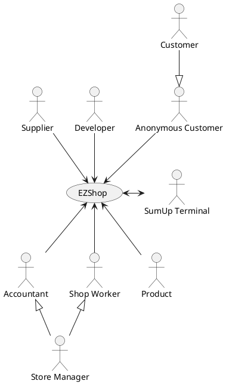
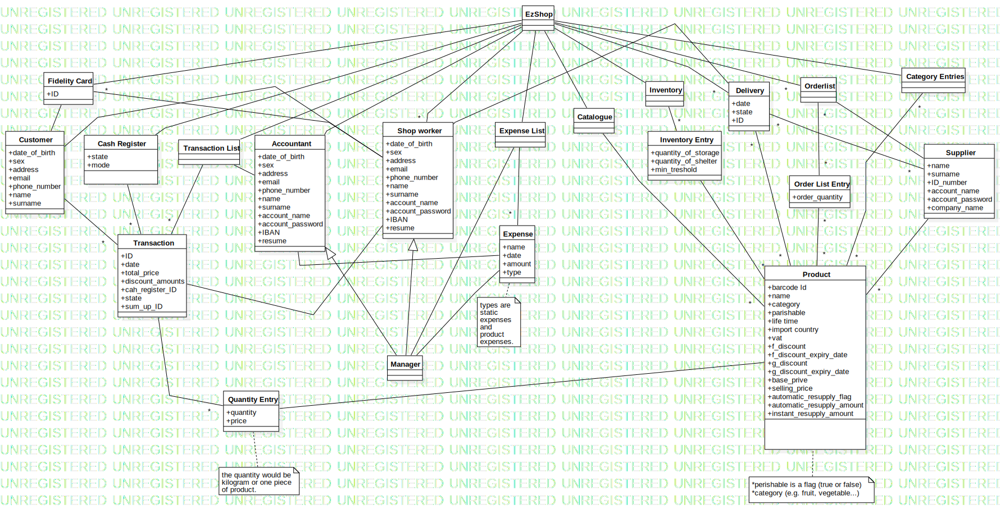

# Requirements Document

Authors:

Date:

Version:

# Contents

- [Essential description](#essential-description)
- [Stakeholders](#stakeholders)
- [Context Diagram and interfaces](#context-diagram-and-interfaces)
	+ [Context Diagram](#context-diagram)
	+ [Interfaces](#interfaces)
- [Stories and personas](#stories-and-personas)
- [Functional and non functional requirements](#functional-and-non-functional-requirements)
	+ [Functional Requirements](#functional-requirements)
	+ [Non functional requirements](#non-functional-requirements)
- [Use case diagram and use cases](#use-case-diagram-and-use-cases)
	+ [Use case diagram](#use-case-diagram)
	+ [Use cases](#use-cases)
    	+ [Relevant scenarios](#relevant-scenarios)
- [Glossary](#glossary)
- [System design](#system-design)
- [Deployment diagram](#deployment-diagram)

# Essential description

Small shops require a simple application to support the owner or manager. A small shop (ex a food shop) occupies 50-200 square meters, sells 500-2000 different item types, has one or a few cash registers
EZShop is a software application to:
* manage sales
* manage inventory
* manage customers
* support accounting


# Stakeholders

| Stakeholder name  | Description |
| ----------------- |:-----------:|
| Store manager | Manages store, can insert, modify and delete users and products. |
| Accountant | Views expenses and income, can manage products on sale and prices. |
| Shop worker | Registers sales and updates stock levels. |
| Supplier | Views reorder needs of shop and updates stock levels upon delivery. |
| Anonymous customer | A customer of the shop not associated with a fidelity card. |
| Customer | A customer of the shop associated with a fidelity card. |
| Developer | Maintains application and receives license payments. |
| SumUp Terminal | POS system that processes credit card payments. |
| Product | An item stored in the shop's inventory that may be for sale. |

# Context Diagram and interfaces

## Context Diagram



## Interfaces
| Actor | Logical Interface | Physical Interface  |
| ------------- |:-------------:| -----:|
| Manager, Accountant          | Web GUI         | Screen, Keyboard, Mouse on PC |
| Shop Worker                  | Web GUI         | Cash Register, Screen, Keyboard, Mouse on PC |
| Supplier                     | Web GUI         | Screen, Keyboard, Mouse on PC |
| Anonymous Customer, Customer | Web GUI         | Touchscreen display of the automatic cash register |
| Product                      | Barcode         | Barcode scanner |
| SumUp Terminal               | API provided by the [SumUp SDK](https://developer.sumup.com/docs/terminal-overview/) | [Web bluetooth API](https://developer.mozilla.org/en-US/docs/Web/API/Web_Bluetooth_API) |
| Developer                    | -               | Remote access (ssh) to the production server for deployments |

# Stories and personas

Sarah is 45 and is the manager of a small grocery shop. She desires to replace those bulky cash registers from the past with a modern solution that can run on commercial off-the-shelf computers equipped with a touch screen display. Periodically Sarah defines special offers for specific products or categories. She wants to track all the sales transaction in an (almost) real-time fashion from her office.

Eric is 33 and is an accountant. He needs to periodically generate reports of all the incomes and expenses of the shops he supervises. Reports include the final balance of the shop for the selected timeframe and the amount of the Value Added Tax (VAT) due to the income revenue authority.

Julia is 27 and is the head of a supplying company that supplies goods to many local shops. She needs an interface for querying the inventory of the shops and generate resupply claim for products that have a low inventory level. When products are delivered to the shop, a shop worker flags the resupply claim as approved, completing the process.

Laura is 36 and is a shop worker in a local shop. She mainly works at the cashier and maintains the inventory of the shop. When a batch of goods is delivered to the shop she approves the resupply claim and updates the inventory level. She desires to define product categories according to the applied VAT and the type of the product. She also needs to flag products that are stored in the warehouse but not available for sale.

Marco is 35 and is a full-time office worker. He is always in a hurry, so he prefers to use the automatic cash register for his daily grocery shopping whenever possible. Also, he doesn't like to bring banknotes and coins along, so he only pays with his credit card.

# Functional and non functional requirements

## Functional Requirements

| ID           | Description  |
| ------------ |:-------------|
|  **FR1**     | **Manage rights. Authorize access to functions to specific actors according to access rights** |
|  **FR2**     | **Manage inventory** |
|  FR2.1       | Insert a new product inside the inventory |
|  FR2.2       | Update the properties of a product |
|  FR2.3       | Remove a product from the inventory |
|  FR2.4       | Add product to the order list of a supplier |
|  FR2.5       | Category management |
|  FR2.5.1     | Create/Update a category |
|  FR2.5.2     | Assign a product to a category |
|  FR2.5.3     | Delete a category |
|  FR2.5.4     | List categories |
|  FR2.5.4     | Show products associated with a category |
|  FR2.6       | Search a product |
|  FR2.7       | Bind a product to a supplier |
|  **FR3**     | **Sales management** |
|  FR3.1       | Start a transaction |
|  FR3.2       | Add or delete products to the transaction |
|  FR3.3       | Cancel a running transaction |
|  FR3.4       | Add a payment method |
|  FR3.5       | Apply discount and special offers, possibly depending on the fidelity card |
|  FR3.6       | Complete checkout and print receipt |
|  FR3.7       | Keep transaction informations |
|  **FR4**     | **Manage customers** |
|  FR4.1       | Define a new customer, or modify an existing one |
|  FR4.2       | Create a fidelity card for the customer |
|  FR4.3       | Delete a customer |
|  FR4.4       | Search a customer |
|  **FR5**     | **Manage catalogue** |
|  FR5.1       | List the catalogue entries |
|  FR5.2       | Update a catalogue entry |
|  FR5.3       | Remove a catalogue entry |
|  FR5.4       | Define a special offer |
|  **FR6**     | **Manage accounting** |
|  FR6.1       | Add an expense |
|  FR6.2       | Compute balance |
|  **FR7**     | **Manage orders** |
|  FR7.1       | Show the order list for the supplier |
|  FR7.2       | Create a new delivery |
|  FR7.3       | List all deliveries for the supplier |
|  FR7.4       | Accepts a delivery |
|  **FR8**     | **Manage supplier** |
|  FR8.1       | Insert a supplier |
|  FR8.2       | List all suppliers |
|  FR8.3       | Update a supplier |
|  FR8.4       | Delete supplier |


### Access right, actor vs function

| Function | Store Manager | Shop Worker | Customer | Anonymous Customer | Accountant | Supplier |
| ------------- |:-------------|--|--|--|--|--|
| FR1 | yes | no | no | no | no | no |
| FR2 | yes | yes | no | no | no | no |
| FR3 | yes | yes | yes | yes | no | no |
| FR4 | yes | yes | no | no | no | no |
| FR5   | yes | no | no | no | yes | no |
| FR6   | yes | no | no | no | yes | no |
| FR7.1   | yes | yes | no | no | no | yes |
| FR7.2   | no | no | no | no | no | yes |
| FR7.3   | yes | yes | no | no | no | no |
| FR8   | yes | no | no | no | no | no |


## Non Functional Requirements

| ID        | Type | Description  | Refers to |
| ------------- |:-------------:| :-----:| -----:|
|  NFR1     | Privacy  | Ensure customer data are stored safely and can't be accessed by non authorized users. | All FR |
|  NFR2     | Privacy | The system complies with local privacy law requirements (GDPR in Europe). | All FR |
|  NFR4     | Reliability | The software should be able to correctly update the inventory level in any situation (even if an error occurs) | All FR |
|  NFR5     | Portability | The application is accessible from any modern browser. The integration with the SumUp terminal is restricted to Chrome 56+ and Edge 79+ due to the compatibility with the Web Bluetooth API required to communicate with the POS terminal.  | All FR |
|  NFR6     | Security | All the users of the systems should be authenticated and no information should be visible to the outside. | All FR |
|  NFR7     | Performance |  The application should complete operations in less than 1 second. | All FR |
|  NFR8     | Maintainability | The application should be always up to date with law requirements and security standards | All FR |
|  NFR9     | Usability | The application should be used with no specific training. | All FR |

# Use case diagram and use cases

## Use case diagram
```plantuml
"Store manager" as StoreManager
(Manage access rights) as FR1
(Manage access rights) as UC1

FR1 ..> UC1 :include

StoreManager -> UC1
```

```plantuml
"Shop worker" as ShopWorker

(Manage inventory) as FR2
(Manage categories) as FR2_7

(Insert a new product) as UC2
(Update the level) as UC3
(Remove a product) as UC4
(Notify reordering needs) as UC5
(Insert a new category) as UC6
(Update a category) as UC7
(List all products) as UC8
(Delete a category) as UC9
(Define a discount) as UC10

/' Inventory management (UC2, UC3, UC4, UC5) '/
FR2 ...> UC2 :include
FR2 ...> UC3 :include
FR2 ....> UC4 :include
FR2 ....> UC5 :include

/' Category management (UC6, UC7, UC8, UC9, UC10) '/
FR2 ..> FR2_7 :include
FR2_7 ...> UC6 :include
FR2_7 ...> UC7 :include
FR2_7 ..> UC8 :include
FR2_7 ..> UC9 :include
FR2_7 ..> UC10 :include

UC2 <-- ShopWorker
UC3 <-- ShopWorker
UC4 <-- ShopWorker
UC5 <-- ShopWorker
UC6 <-- ShopWorker
UC7 <-- ShopWorker
UC8 <--> ShopWorker
UC9 <-- ShopWorker
UC10 <-- ShopWorker
```

```plantuml
"Anonymous Customer, Customer, Shop Worker" as ACCSW
"SumUp Terminal" as SumUpTerminal
"Product" as Product

(Manage sales) as FR3

(Creation of a new transaction) as UC11
(Attach a product to the transaction) as UC12
(Remove a product from the transaction) as UC13
(Payment) as UC14
(Cancel a transaction) as UC15

/' Sale transactions management (UC11, UC12, UC13, UC14, UC15) '/
FR3 ..> UC11 :include
FR3 ..> UC12 :include
FR3 ..> UC13 :include
FR3 ..> UC14 :include
FR3 ..> UC15 :include

UC12 <-- ACCSW
UC11 <-- ACCSW
UC13 <-- ACCSW
UC15 <-- ACCSW
UC14 <--> ACCSW

UC14 <--> SumUpTerminal

UC12 <-- Product
```

```plantuml
"Supplier" as Supplier
"Employee" as Employee

(Manage orders) as FR7

/' Orders management (UC16, UC17, UC18, UC19) '/
(Check resupply needs) as UC16
(Post resupply claim) as UC17
(Edit pending resupply claim) as UC18
(Approve pending resupply claim) as UC19

FR7 ..> UC16 :include
FR7 ..> UC17 :include
FR7 ..> UC18 :include
FR7 ..> UC19 :include

UC16 <-- Supplier
UC17 <-- Supplier
UC18 <-- Supplier
UC19 <-- Employee
```

```plantuml
"Accountant" as Accountant

(Manage accounting) as FR6

/' Manage accounting (UC20) '/
(View expenses and earnings) as UC20

FR6 ..> UC20 :include

UC20 --> Accountant
```

```plantuml
"Shop Worker" as ShopWorker

(Manage customers) as FR4

/' Customers management (UC21, UC22, UC23) '/
(Define a new customer) as UC21
(Delete a customer) as UC22
(Modify the customer) as UC23

FR4 ..> UC21 :include
FR4 ..> UC22 :include
FR4 ..> UC23 :include

UC21 <-- ShopWorker
UC22 <-- ShopWorker
UC23 <-- ShopWorker
```

```plantuml
"Accountant" as Accountant

(Manage catalogue) as FR5

/' Catalogue management (UC24, UC25, UC26, UC27, UC28) '/
(Manage the catalogue) as UC24
(Update a product) as UC25
(Delete a product) as UC26
(Define a special offer) as UC27
(Define a special offer) as UC28

FR5 ..> UC24 :include
FR5 ..> UC25 :include
FR5 ..> UC26 :include
FR5 ..> UC27 :include
FR5 ..> UC28 :include

UC24 <-- Accountant
UC25 <-- Accountant
UC26 <-- Accountant
UC27 <-- Accountant
UC28 <-- Accountant
```

```plantuml
"Store manager" as StoreManager

(Manage suppliers) as FR

/' Supplier management (UC31, UC32, UC33, UC34) '/
(Insert a supplier) as UC31
(List all suppliers) as UC32
(Update a supplier) as UC33
(Delete a supplier) as UC34

FR ..> UC31 :include
FR ..> UC32 :include
FR ..> UC33 :include
FR ..> UC34 :include

UC31 <-- StoreManager
UC32 <-- StoreManager
UC33 <-- StoreManager
UC34 <-- StoreManager
```

### Use case 1, UC1 - Manage rights
| Actors Involved    | Store Manager |
| ------------------ |:-------------:|
|  Precondition      | The new employee E does not have an account on the system. |  
|  Post condition    | The new employee E have an account on the system. |
|  Nominal Scenario  | The Store Manager hires a new employee E and creates a new account with either 'accountant' or 'shop-worker' rights. |
|  Variants          | The Store Manager updates the rights of an employee E. |


### Use case 2, UC2 - Insert a new product inside the inventory
| Actors Involved    | Store Manager |
| ------------------ |:-------------:|
|  Precondition      | Product P does not exist inside the inventory. |  
|  Post condition    | Product P is created. |
|                    | P's properties, quantity and supplier informations are set.  |
|  Nominal Scenario  | A new product is inserted, so the Manager enters all the infos inside the inventory. |
|  Variants          | - |


### Use case 3, UC3 - Update the properties of a product
| Actors Involved    | Store Manager |
| ------------------ |:-------------:|
|  Precondition      | Product P already exists inside the inventory. |  
|  Post condition    | Store Manager updates product P infos inside the inventory |
| | P's properties, quantity and supplier informations are updated. |
|  Nominal Scenario  | New supplies of product P arrive at the shop, the Store Manager has to set the entries P.newunits. |
|  Variants          | - |


### Use case 4, UC4 - Remove a product from the inventory
| Actors Involved    | Store Manager |
| ------------------ |:-------------:|
|  Precondition      | Product P exists inside the inventory |  
|  Post condition    | Product P is deleted from the inventory. |
|                    | The catalogue entry for product P is removed.|
|  Nominal Scenario  | The Manager deletes a product from the system, and he has to confirm his choice |
|  Variants          | - |


### Use case 5, UC5 - Add product to the order list
| Actors Involved    | Shop Worker |
| ------------------ |:-------------:|
|  Precondition      | Product P is inside the inventory.  |
|  Post condition    | The entry for product P in the order list of its supplier is possibly updated. |
|  Nominal Scenario  | Product P is already in the order list of its supplier. |
|  Variants          | Product P is NOT associated with a supplier. |
|                    | Product P is NOT already in the order list of its supplier. |
|                    | Product P's resupply quantity is NOT defined. |

##### Scenario 5.1
| Scenario 5.1      | Product is already in the order list of its supplier. |
| ----------------- |:-------------:|
|  Precondition     | Product P is inside the inventory. |
|                   | A supplier S is associated with P (S = P.supplier). |
|                   | Product P is already in the order list of supplier S (S.order_list[P] is defined). |
|                   | P.instant_resupply_quantity is defined. |
|  Post condition   | The entry for product P in the order list of one supplier is possibly updated. |
| Step#  | Description  |
| 1      | The shop worker selects a product P from the inventory. |
| 2      | The shop worker selects to resupply product P. |
| 3      | The entry for product P in the order list of the supplier S is updated (S.order_list[P] += P.instant_resupply_quantity). |

##### Scenario 5.2
| Scenario 5.2      | Product is NOT associated with a supplier. |
| ----------------- |:-------------:|
|  Precondition     | Product P is inside the inventory. |
|                   | A supplier is NOT associated with P (P.supplier is NOT defined). |
|  Post condition   | - |
| Step#  | Description  |
| 1      | The shop worker selects a product P from the inventory. |
| 2      | The shop worker selects to resupply product P. |
| 3      | Product P is not associated with a supplier; an error is raised. |

##### Scenario 5.3
| Scenario 5.3      | Product is NOT already in the order list of its supplier. |
| ----------------- |:-------------:|
|  Precondition     | Product P is inside the inventory. |
|                   | A supplier S is associated with P (S = P.supplier). |
|                   | Product P is already in the order list of supplier S (S.order_list[P] is NOT defined). |
|  Post condition   | Product P is inserted in the order list of its supplier. |
| Step#  | Description  |
| 1      | The shop worker selects a product P from the inventory. |
| 2      | The shop worker selects to resupply product P. |
| 3      | The entry for product P is inserted in the order list of supplier S (S.order_list[P] = P.instant_resupply_quantity). |

##### Scenario 5.4
| Scenario 5.4      | Product P's resupply quantity is NOT defined. |
| ----------------- |:-------------:|
|  Precondition     | Product P is inside the inventory. |
|                   | P.instant_resupply_quantity is NOT defined. |
|  Post condition   | - |
| Step#  | Description  |
| 1      | The shop worker selects a product P from the inventory. |
| 2      | The shop worker selects to resupply product P. |
| 3      | The entry for product P is inserted in the order list of supplier S (S.order_list[P] = P.instant_resupply_quantity). |


### Use case 6, UC6 - Insert a new category
| Actors Involved    | Shop Worker |
| ------------------ |:-------------:|
|  Precondition      | - |  
|  Post condition    | Category C is created. |
|  Nominal Scenario  | A new category is created successfully. |
|  Variants          | A category with the same name already exists. |

##### Scenario 6.1
| Scenario 6.1      | A new category is created successfully. |
| ----------------- |:-------------:|
|  Precondition     | - |
|  Post condition   | Category C is created. |
| Step#  | Description  |
| 1      | The shop worker defines the properties of a new category C. |
| 2      | C is created. |

##### Scenario 6.2
| Scenario 6.2      | A category with the same name already exists. |
| ----------------- |:-------------:|
|  Precondition     | - |
|  Post condition   | - |
| Step#  | Description  |
| 1      | The shop worker defines the properties of a new category C. |
| 2      | A category with the same name already exists and an error is raised. |


### Use case 7, UC7 - Update an existing category
| Actors Involved    | Shop Worker |
| ------------------ |:-------------:|
|  Precondition      | Category C exists. |  
|  Post condition    | Category C is possibly updated. |
|  Nominal Scenario  | The category is updated successfully. |
|  Variants          | A category with the same name already exists and an error is raised. |

##### Scenario 7.1
| Scenario 7.1      | The category is updated successfully. |
| ----------------- |:-------------:|
|  Precondition     | Category C exists |
|  Post condition   | C is updated successfully. |
| Step#  | Description  |
| 1      | The shop worker selects a category C. |
| 2      | The shop worker modifies the properties of C. |
| 3      | C is updated successfully. |

##### Scenario 7.2
| Scenario 7.2      | A category with the same name already exists and an error is raised. |
| ----------------- |:-------------:|
|  Precondition     | Category C exists |
|  Post condition   | - |
| Step#  | Description  |
| 1      | The shop worker selects a category C. |
| 2      | The shop worker modifies the properties of C. |
| 3      | A category with the same name already exists and an error is raised. |


### Use case 8, UC8 - List all the products associated with a category
| Actors Involved    | Shop Worker |
| ------------------ |:-------------:|
|  Precondition      | Category C exists. |
|  Post condition    | A list of products associated with category C is shown. |
|  Nominal Scenario  | List all the products associated with category C. |
|  Variants          | - |

##### Scenario 8.1
| Scenario 8.1      | List all the products associated with a category. |
| ----------------- |:-------------:|
|  Precondition     | Category C exists. |
|  Post condition   | A list of products associated with category C is shown. |
| Step#  | Description  |
| 1      | The shop worker selects a category C. |
| 2      | The system shows all the products associated with category C. |


### Use case 9, UC9 - Delete a category
| Actors Involved    | Shop Worker |
| ------------------ |:-------------:|
|  Precondition      | Category C exists. |
|  Post condition    | Category C is possibly removed. |
|  Nominal Scenario  | The shop worker selects a category and removes it. |
|  Variants          | There are products associated to category C. |

##### Scenario 9.1
| Scenario 9.1      | The shop worker selects a category and removes it.  |
| ----------------- |:-------------:|
|  Precondition     | Category C exists. |
|  Post condition   | Category C is removed. |
| Step#  | Description  |
| 1      | The shop worker selects a category C. |
| 2      | Category C is removed. |

##### Scenario 9.2
| Scenario 9.2      | There are products associated to the category.  |
| ----------------- |:-------------:|
|  Precondition     | Category C exists. |
|  Post condition   | - |
| Step#  | Description  |
| 1      | The shop worker selects a category C. |
| 2      | There are products associated to category C (C.products.length > 0): the category is not removed and an error is raised. |


### Use case 10, UC10 - Bind a product to a supplier
| Actors Involved    | Shop Worker |
| ------------------ |:-------------:|
|  Precondition      | Product P is inside the inventory. |
|                    | Supplier S exists. |
|  Post condition    | P.supplier = S. |
|  Nominal Scenario  | A supplier is associated with the product. |
|  Variants          | - |

##### Scenario 10.1
| Scenario 10.1      | A supplier is associated with the product. |
| ------------------ |:-------------:|
|  Precondition      | Product P is inside the inventory. |
|                    | Supplier S exists. |
|  Post condition    | P.supplier = S. |
| Step#  | Description  |
| 1      | The shop worker selects product P. |
| 2      | The shop worker selects a supplier S. |
| 3      | Product P is associated with supplier S (P.supplier = S). |


### Use case 11, UC11 - Creation of a new sale transaction
| Actors Involved     | Shop Worker, Anonymous Customer, Customer |
| ------------------- |:-------------:|
|  Precondition       | The cash register CR is not processing other transactions (CR.state == 'ready' and CR.running_transaction == null). |  
|  Post condition     | Transaction T is created. |
|                     | Transaction T is ready (T.state = 'ready') and associated with the cash register that created it (CR.running_transaction = T.id and CR.state = 'busy') |
|                     | Depending on the actor that created the transaction, the cash register mode is set. If the actor is a shop worker, the cash register runs in 'supervised' mode (all payment methods are available). If the actor is a customer, the cash register runs in 'unsupervised' mode (the cash payment method is not available and the actor can not cancel the transaction autonomously) |
|  Nominal Scenario   | The shop worker S creates a new sale transaction T for the anonymous customer. |
|  Variants           | The shop worker S creates a new sale transaction T and the customer shows a fidelity card. |
|                     | The anonymous customer AC creates a new sale transaction. |
|                     | The customer C creates a new sale transaction and shows a fidelity card. |

##### Scenario 11.1
| Scenario 11.1     | The shop worker S creates a new sale transaction T and the customer shows a fidelity card. |
| ----------------- |:-------------:|
|  Precondition     | The cash register CR is not processing other transactions (CR.state == 'ready' and CR.running_transaction == null). |  
|  Post condition   | Transaction T is created. |
|                   | Transaction T is ready (T.state = 'ready') and associated with the cash register that created it (CR.running_transaction = T.id and CR.state = 'busy') |
|                   | The fidelity card FC is attached to the transaction T (T.fidelity_card). |
|                   | The 'supervised' cash register mode is set (CR.mode = 'supervised'). |
| Step#  | Description  |
|  1     | The shop worker S starts a new transaction T. |
|  2     | The shop worker S scans the fidelity card FC of the customer. |
|  3     | The fidelity card FC is attached to the transaction. |
|  4     | The cash register mode is set. |

##### Scenario 11.2
| Scenario 11.2     | The anonymous customer AC creates a new sale transaction. |
| ----------------- |:-------------:|
|  Precondition     | The cash register CR is not processing other transactions (CR.state == 'ready' and CR.running_transaction == null). |  
|  Post condition   | Transaction T is created. |
|                   | Transaction T is ready (T.state = 'ready') and associated with the cash register that created it (CR.running_transaction = T.id and CR.state = 'busy') |
|                   | The fidelity card FC is attached to the transaction T (T.fidelity_card). |
|                   | The 'unsupervised' cash register mode is set (CR.mode = 'unsupervised'). |
| Step#  | Description  |
|  1     | The shop worker S starts a new transaction T. |
|  2     | The shop worker S scans the fidelity card FC of the customer. |
|  3     | The fidelity card FC is attached to the transaction. |
|  4     | The cash register mode is set. |


### Use case 12, UC12 - Attach a product to a transaction
| Actors Involved     | Shop Worker, Anonymous Customer, Customer, Product |
| ------------------- |:-------------:|
|  Precondition       | Transaction T exists and is run by an actor A, either a shop worker or the customer himself. |
|                     | Product P exists and its inventory level is at least n (P.units >= n) |  
|                     | Cash register CR is ready to modify transaction T (CR.running_transaction == T and CR.state == 'busy'). |
|  Post condition     | CR is ready to further modify the list of products associated to T (CR.running_transaction == T and CR.state == 'busy'). |
|                     | CR is ready to complete check-out for transaction T (T.products.length > 0). |
|                     | Product P is added to the products list of transaction T with quantity n. |
|                     | The inventory level for product P is updated (P.units -= n) |
|  Nominal Scenario   | Attach a product to the transaction. |
|  Variants           | - |

##### Scenario 12.1
| Scenario 12.1     | Attach a product to the transaction. |
| ----------------- |:-------------:|
|  Precondition     | Transaction T exists and is run by an actor A, either a shop worker or a the customer himself. |
|                   | Product P exists and its inventory level is at least n (P.units >= n) |  
|                   | Cash register CR is ready to modify transaction T (CR.running_transaction == T and CR.state == 'busy'). |
|  Post condition   | CR is ready to further modify the list of products associated to T (CR.running_transaction == T and CR.state == 'busy'). |
|                   | CR is ready to complete check-out for transaction T (T.products.length > 0). |
|                   | Product P is added to the products list of transaction T with quantity n. |
|                   | The inventory level for product P is updated (P.units -= n) |
| Step#  | Description  |
| 1      | The actor A scans the barcode of the product. |
| 2      | The product informations are shown on the cash register's screen. |
| 3      | The actor A possibly changes the quantity n of the product P in the transaction. |


### Use case 13, UC13 - Remove a product from a transaction
| Actors Involved     | Shop Worker, Anonymous Customer, Customer, Product |
| ------------------- |:-------------:|
|  Precondition       | Transaction T exists and is run by an actor A, either a shop worker or a the customer himself. |
|                     | Product P is attached to the transaction with quantity n (P in T.products && T.products[P] == n) |  
|                     | Cash register CR is ready to modify transaction T (CR.running_transaction == T && CR.state == 'busy'). |
|  Post condition     | CR is ready to further modify the list of products associated to T (CR.running_transaction == T and CR.state == 'busy'). |
|                     | CR is possibly ready to complete check-out for transaction T (T.products.length > 0). |
|                     | Product P is removed from the products list of transaction T. |
|                     | The inventory level for product P is restored (P.units += n) |
|  Nominal Scenario   | Remove a product P from transaction T. |
|  Variants           | - |

##### Scenario 13.1
| Scenario 13.1     | Remove a product from a transaction |
| ----------------- |:-------------:|
|  Precondition     | Transaction T exists and is run by an actor A, either a shop worker or a the customer himself. |
|                   | Product P is attached to the transaction with quantity n (P in T.products && T.products[P] == n) |  
|                   | Cash register is ready to modify transaction T (T.cash_register == CR && CR.state == 'busy'). |
|  Post condition   | CR is ready to further modify the list of products associated to T. |
|                   | CR is possibly ready to complete check-out for transaction T (T.products.length > 0). |
|                   | Product P is removed from the products list of transaction T. |
|                   | The inventory level for product P is restored (P.units += n) |
| Step#  | Description  |
| 1      | The actor A selects a product P to be removed from the transaction |
| 2      | Product P is removed from the transaction and the inventory level for product P is restored. |


### Use case 14, UC14 - Payment of a transaction
| Actors Involved     | Shop Worker, Anonymous Customer, Customer, SumUp Terminal |
| ------------------- |:-------------:|
|  Precondition       | Transaction T exists and is run by an actor A, either a shop worker or a the customer itself. |
|                     | At least one product is attached to transaction T (T.products.length > 0). |  
|                     | Cash register CR is ready to modify transaction T (CR.running_transaction == T and CR.state == 'busy'). |
|  Post condition     | Transaction T is completed, either successfully or with an exception. |
|  Nominal Scenario   | The customer pays in cash and the transaction is completed successfully. |
|  Variants           | The customer pays in cash but he has not enough money. |
|                     | The customer pays with credit card and the transaction is completed successfully. |
|                     | The customer pays with credit card but the POS system notifies a payment exception. |

##### Scenario 14.1
| Scenario 14.1      | The customer pays in cash and the transaction is completed successfully. |
| ----------------- |:-------------:|
|  Precondition     | Transaction T exists and is run by a shop worker A. |
|                   | At least one product is attached to transaction T (T.products.length > 0). |  
|                   | Cash register CR is ready to modify transaction T (CR.running_transaction == T and CR.state == 'busy'). |
|                   | The cash register is running in 'supervised' mode (CR.mode == 'supervised'). |
|  Post condition   | CR is ready for processing another transaction (CR.state == 'ready'). |
|                   | The sale transaction is recorded in the the transaction register (T.state = 'completed'). |
| Step#  | Description  |
|  1     | The cash register computes the total by reading the product prices from the catalogue and taking into account the available special offers and the fidelity program benefits. |
|  2     | The shop worker A selects the 'cash' payment method and types the cash amount given by the customer. |
|  3     | The cash register CR computes the change. |
|  4     | The checkout is completed successfully and a receipt is printed. |
|  5     | T is recorded in the transaction register. |

##### Scenario 14.2
| Scenario 14.2     | The customer pays in cash but he has not enough money. |
| ----------------- |:-------------:|
|  Precondition     | Transaction T exists and is run by a shop worker A. |
|                   | At least one product is attached to transaction T (T.products.length > 0). |  
|                   | Cash register CR is ready to modify transaction T (CR.running_transaction == T and CR.state == 'busy'). |
|                   | The cash register is running in 'supervised' mode (CR.mode == 'supervised'). |
|  Post condition   | CR is ready for processing another transaction (CR.state == 'ready'). |
|                   | The inventory level for products attached to the transaction is restored. |
|                   | The sale transaction is NOT recorded in the the transaction register. |
| Step#  | Description  |
|  1     | The cash register computes the total by reading the product prices from the catalogue and taking into account the available special offers and the fidelity program benefits. |
|  2     | C selects the 'cash' payment method but the customer has not enough cash. A warning is raised and the transaction is NOT aborted. The actor A can either remove products from the transaction or cancel it. |

##### Scenario 14.3
| Scenario 14.3     | The customer pays with credit card and the transaction is completed successfully. |
| ----------------- |:-------------:|
|  Precondition     | Transaction T exists and is run by an actor A, either a shop worker or a the customer itself. |
|                   | At least one product is attached to transaction T (T.products.length > 0). |  
|                   | Cash register CR is ready to modify transaction T (CR.running_transaction == T and CR.state == 'busy'). |
|                   | The credit card POS system is ready. |
|  Post condition   | CR is ready for processing another transaction (CR.state == 'ready'). |
|                   | The sale transaction is recorded in the the transaction register (T.state = 'completed'). |
| Step#  | Description  |
|  1     | The cash register computes the total by reading the product prices from the catalogue and taking into account the available special offers and the fidelity program benefits. |
|  2     | The cash register CR communicates the total to the credit card POS system. |
|  3     | The SumUp Terminal notifies a successful payment. |
|  4     | The checkout is completed successfully and a receipt is printed. |
|  5     | T is recorded in the transaction register. |

##### Scenario 14.4
| Scenario 14.4     | The customer pays with credit card but the POS system notifies a payment exception. |
| ----------------- |:-------------:|
|  Precondition     | Transaction T exists and is run by an actor A, either a shop worker or a the customer itself. |
|                   | At least one product is attached to transaction T (T.products.length > 0). |  
|                   | Cash register CR is ready to modify transaction T (CR.running_transaction == T and CR.state == 'busy'). |
|                   | The credit card POS system is ready. |
|  Post condition   | CR is ready for processing another transaction (CR.state == 'ready'). |
|                   | The inventory level for products attached to the transaction is restored. |
|                   | The sale transaction is NOT recorded in the the transaction register. |
| Step#  | Description  |
|  1     | The cash register computes the total by reading the product prices from the catalogue and taking into account the available special offers and the fidelity program benefits. |
|  2     | The cash register CR communicates the total to the credit card POS system. |
|  3     | The SumUp Terminal notifies an exception. |
|  4     | Depending on the type of the exception raised by the POS system, the actor A can either proceed with the checkout using a different payment method or cancel the transaction. |


### Use case 15, UC15 - Cancel a running sale transaction
| Actors Involved     | Shop Worker, Anonymous Customer, Customer |
| ------------------- |:-------------:|
|  Precondition       | Transaction T exists and is run by an actor A, either a shop worker or a the customer himself. |
|                     | Cash register is ready to modify transaction T (T.cash_register == CR). |
|  Post condition     | Transaction T is cancelled. |
|                     | CR is ready for processing another transaction (CR.state == 'ready'). |
|                     | The inventory level for products attached to the transaction is restored. |
|                     | The sale transaction is NOT recorded in the the transaction register. |
|  Nominal Scenario   | The shop worker A cancels the transaction. |
|  Variants           | The customer A cancels the transaction. |

##### Scenario 15.1
| Scenario 15.1     | The shop worker cancels the transaction |
| ----------------- |:-------------:|
|  Precondition     | Transaction T exists and is run by the shop worker A. |
|                   | Cash register is ready to modify transaction T (T.cash_register == CR). |
|                   | The cash register is running in 'supervised' mode (CR.mode == 'supervised'). |
|  Post condition   | Transaction T is cancelled. |
|                   | CR is ready for processing another transaction (CR.state == 'ready'). |
|                   | The inventory level for products attached to the transaction is restored. |
|                   | The sale transaction is NOT recorded in the the transaction register. |
| Step#  | Description  |
| 1      | The actor A asks the application to cancel a transaction. |
| 2      | The transaction is cancelled. |

##### Scenario 15.2
| Scenario 15.2     | The customer cancels the transaction |
| ----------------- |:-------------:|
|  Precondition     | Transaction T exists and is run by an customer A. |
|                   | Cash register is ready to modify transaction T (T.cash_register == CR). |
|                   | The cash register is running in 'unsupervised' mode (CR.mode == 'unsupervised'). |
|  Post condition   | Transaction T is cancelled (T.state = 'cancelled'). |
|                   | CR is ready for processing another transaction (CR.state == 'ready'). |
|                   | The inventory level for products attached to the transaction is restored. |
|                   | The sale transaction is NOT recorded in the the transaction register. |
| Step#  | Description  |
| 1      | The actor A asks the application to cancel a transaction. |
| 2      | The application requires authentication of a shop worker. The authentication request is repeated until the procedure is successful. |
| 3      | The transaction is cancelled. |


### Use case 16, UC16 - Show the order list for the supplier
| Actors Involved  | Supplier |
| ---------------- |:-------------:|
| Precondition     | Supplier S exists and is logged in. |  
| Post condition   | The order list of supplier S is shown. |
| Nominal Scenario | The supplier S views its order list. |
| Variants         | - |

##### Scenario 16.1
| Scenario 16.1     | The supplier views its order list. |
| ----------------- |:-------------:|
| Precondition      | Supplier S exists and is logged in. |  
| Post condition    | The order list of supplier S is shown. |
| Step#  | Description  |
| 1      | The supplier selects to show the products included in its order list, possibly filtering by category. |
| 2      | The application shows the order list. |


### Use case 17, UC17 - Create a delivery
| Actors Involved  | Supplier |
| ---------------- |:-------------:|
| Precondition     | Supplier S exists and is logged in. |
|                  | The shop is not fully stocked: at least one product in the order list of the supplier is pending resupply (S.order_list[P] > 0). |
|                  | The application is showing the order list for supplier S. |
| Post condition   | A pending delivery D is created (D.state = 'pending'). |
| Nominal Scenario | A new delivery is created. |
| Variants         | - |

##### Scenario 17.1
| Scenario 17.1     | A new delivery is created |
| ----------------- |:-------------:|
| Precondition      | Supplier S exists and is logged in. |
|                   | The shop is not fully stocked: at least one product in the order list of the supplier is pending resupply. |
|                   | The application is showing the order list for supplier S. |
| Post condition    | A pending delivery D is created. |
| Step#  | Description  |
| 1      | The supplier S selects one or more products from its order list. |
| 2      | For each product, the supplier S indicates the quantity n that is going to be delivered to the shop. The quantity n should be less or equal than the quantity specified in the order list (n <= S.order_list[P]) |
| 3      | For each product in the order list, its order quantity is decremented by n (S.order_list[P] -= n) |
| 3      | A pending delivery for the selected products and quantities is created. |


### Use case 18, UC18 - List all deliveries for the supplier
| Actors Involved  | Supplier |
| ---------------- |:-------------:|
| Precondition     | Supplier S is logged into the system |
| Post condition   | A list of deliveries of supplier S is shown. |
| Nominal Scenario | List all deliveries for supplier S. |
| Variants | - |


### Use case 19, UC19 - Update a delivery
| Actors Involved  | Supplier |
| ---------------- |:-------------:|
| Precondition     | Supplier S exists and is logged in. |
|                  | The application is showing a list of deliveries for supplier S. |
|                  | A pending delivery D exists (D.state == 'pending'). |
| Post condition   | Delivery D is updated. |
| Nominal Scenario | Update a delivery. |
| Variants         | - |

##### Scenario 19.1
| Scenario 19.1     | Update a delivery |
| ----------------- |:-------------:|
| Precondition      | Supplier S exists and is logged in. |
|                   | The application is showing a list of deliveries for supplier S. |
|                   | A pending delivery D exists (D.state == 'pending'). |
| Post condition    | Delivery D is updated. |
| Step#  | Description  |
| 1      | The supplier S selects a pending delivery (D.state == 'pending'). |
| 2      | For each product in the delivery, the supplier S updates the quantity n that is going to be delivered to the shop. The quantity n should be less or equal than the quantity specified in the order list (n <= S.order_list[P]) |
| 3      | For each product in the order list, its order quantity is decremented by n (S.order_list[P] -= n) |
| 3      | A pending delivery for the selected products and quantities is created. |


### Use case 20, UC20 - Accept a delivery
| Actors Involved  | Employee |
| ---------------- |:-------------:|
| Precondition     | A pending delivery D exists (D.state == 'pending'). |
| Post condition   | The items from D are added to the shop's inventory. |
|                  | D is marked as completed (D.state = 'completed'). |
| Nominal Scenario | The products delivered correspond to the agreed amount. |
| Variants         | The products delivered do NOT correspond to the agreed amount. |

##### Scenario 20.1
| Scenario 20.1     | The products delivered correspond to the agreed amount |
| ----------------- |:-------------:|
| Precondition      | A pending delivery D exists (D.state == 'pending'). |
| Post condition    | The items from D are added to the shop's inventory. |
|                   | D is marked as completed (D.state = 'completed'). |
| Post condition    | Delivery D is updated. |
| Step#  | Description  |
| 1      | For each product inside the delivery, the inventory level of the product is incremented by the quantity delivered. |
| 2      | D is marked as completed (D.state = 'completed'). |

##### Scenario 20.2
| Scenario 20.2     | The products delivered do NOT correspond to the agreed amount |
| ----------------- |:-------------:|
| Precondition      | A pending delivery D exists (D.state == 'pending'). |
|                   | The delivery contains a product P whose delivered amount is less than the agreed quantity. |
| Post condition    | The inventory entry for product P is incremented by the delivered quantity. |
|                   | In the order list of the supplier associated with D, the entry for product P is updated. |
| Post condition    | Delivery D is updated. |
| Step#  | Description  |
| 1      | The inventory level of the product is incremented by the quantity delivered. |
| 2      | In the order list of the supplier associated with D, the entry for product P is incremented by the difference between the agreed amount for the delivery and the actuallly delivered quantity. |
| 2      | D is marked as completed (D.state = 'completed'). |


### Use case 21, UC21 - Add an expense
| Actors Involved  | Accountant |
| ---------------- |:-------------:|
| Precondition     | - |  
| Post condition   | An expense E is added to the accounting register. |
| Nominal Scenario | The accountant manually enters an expense E to the accounting register. |
| Variants         | - |

##### Scenario 21.1
| Scenario 21.1     | The accountant manually enters an expense to the accounting register. |
| ----------------- |:-------------:|
|  Precondition     | - |
|  Post condition   | An expense E is added to the accounting register. |
| Step#  | Description  |
| 1      | The accountant enters the properties of a new expense E. |
| 2      | Expense E is associated with an expense type (i.e bill, salary, rent, etc...). |
| 3      | An expense E is added to the accounting register. |
​

### Use case 22, UC22 - Compute balance
| Actors Involved  | Accountant |
| ---------------- |:-------------:|
| Precondition     | - |  
| Post condition   | A report of the expenses and earning of the shop is produced. |
| Nominal Scenario | The system shows the expenses and earnings for the shop. |
| Variants         | - |

##### Scenario 22.1
| Scenario 22.1     | The system shows the expenses and earnings for the shop. |
| ----------------- |:-------------:|
|  Precondition     | - |
|  Post condition   | A report of the expenses and earning of the shop is produced. |
| Step#  | Description  |
| 1      | The accountant selects a time window and a set of expense/earning types. |
| 2      | The system produces a detailed report of the transaction (expenses and earnings) based on the time window and the types selected.  |


### Use case 23, UC23 - Define a new customer
| Actors Involved     | Shop Worker |
| ------------------- |:-------------:|
|  Precondition       | The Actor can fill the all essential informations about customer |
|                     | Customer does not exist in the system |
|  Post condition     | Actor fills the Customer's info |
|  					  | A fidelity card is paired with customer |
|                     | The Customer is added to the system |
|  Nominal Scenario   | Actor reaches the GUI of Customer via a browser. After having filled all the needed information, the Actor gives the Fidelity Card to the new Customer. |
|  Variants           | The email address or phone number is associated to another Customer: raise an error after "Submit" button is clicked |
|  Variants           | Some information marked with "*" (important) are missing: raise an error after "Submit" button is clicked |


### Use case 24, UC24 - Delete a customer
| Actors Involved     | Shop Worker |
| ------------------- |:-------------:|
|  Precondition       | Customer exists in the system. |  
|  Post condition     | The Customer deleted from the system. |
|                     | Deactivate Fidelity Card of Customer |
|  Nominal Scenario   | Actor reaches the GUI of Customer via browser. The Actor Search the Customer through the list and clicks on "Delete" button. After the confirmation the Customer is deleted from the database and his Card deactivated. |
|  Variants           | If Customer's Fidelity Card has some points left, raise a Warning after pressing the "Delete" button. |


### Use case 25, UC25 - Modify the customer
| Actors Involved     | Shop Worker |
| ------------------- |:-------------:|
|  Precondition       | Customer exists in the system. |  
|  Post condition     | The customer information has been updated on the system. |
|  Nominal Scenario   | Actor reaches the GUI of Customer via browser. After having filled all the information that need to be modified, the Actor saves the changes. |
|  Variants           | The new email address/phone number is associated to another Customer: raise an error after "Submit" button is clicked |
|  Variants           | The Customer has lost his Fidelity Card, so the Actor gives him a new one with a new ID, restoring Customer's points and deactivates the old one |


### Use case 26, UC26 - List the catalogue entries

| Actors Involved    | Store Manager, Accountant |
| ------------------ |:-------------:|
|  Precondition      | - |
|  Post condition    | A list of catalogue entries is produced. |
|  Nominal Scenario  | Filter and list the catalogue entries. |
|  Variants          | - |

##### Scenario 26.1
| Scenario 26.1     | Filter and list the catalogue entries |
| ----------------- |:-------------:|
| Precondition      | - |
| Post condition    | A list of catalogue entries is produced. |
| Step#  | Description  |
| 1      | The actor possibly enters a text query. |
| 2      | The application shows a list of catalogue entries, possibly filtering the names based on the provided query. |


### Use case 27, UC27 - Update a catalogue entry
| Actors Involved    | Store Manager, Accountant |
| ------------------ |:-------------:|
|  Precondition      | The application is showing a list of catalogue entries including P. |
|  Post condition    | The properties of product P (price, description, ...) are updated. |
|  Nominal Scenario  | The actor selects product P from the list and modifies its properties. |
|  Variants          | - |

##### Scenario 27.1
| Scenario 27.1     | The actor selects a product from the lists and modifies its properties |
| ----------------- |:-------------:|
|  Precondition     | The application is showing a list of catalogue entries including P. |
|  Post condition   | The properties of product P (price, description, ...) are updated. |
| Step#  | Description  |
| 1      | The actor selects a product P from the shown list. |
| 2      | The actor modifies the properties of product P. |
| 3      | The product P is updated. |


### Use case 28, UC28 - Define a special offer for the product
| Actors Involved     | Manager, Accountant |
| ------------------- |:-------------:|
|  Precondition       | The application is showing a list of catalogue entries including P. |
|  Post condition     | The special offers for a product P are updated. |
|  Nominal Scenario   | The actor selects a product from the list and modifies its special offers |
|  Variants           | - |

##### Scenario 28.1
| Scenario 28.1     | The actor selects a product from the list and modifies its special offers |
| ----------------- |:-------------:|
|  Precondition     | The application is showing a list of catalogue entries including P. |
|  Post condition   | The special offers for product P are updated. |
| Step#  | Description  |
| 1      | The actor selects product P from the shown list. |
| 2      | The actor enters the percentage discount for anonymous customers (it may be zero). |
| 3      | The actor enters the percentage discount for customers (it may be zero). |
| 4      | The actor selects an expiration date for the discounts. |
| 5      | The special offers for product P are updated. |


### Use case 29, UC29 - Insert a supplier
| Actors Involved  | Store manager |
| ---------------- |:-------------:|
| Precondition     | - |  
| Post condition   | A supplier S is created. |
| Nominal Scenario | A new supplier S is created successfully. |
| Variants         | - |

##### Scenario 29.1
| Scenario 29.1     | A new supplier is created successfully. |
| ----------------- |:-------------:|
| Precondition      | - |
| Post condition    | A supplier S is created. |
| Step#  | Description  |
| 1      | The store manager enters the properties of a supplier S. |
| 2      | The supplier S is created. |


### Use case 30, UC30 - List all suppliers
| Actors Involved  | Store manager |
| ---------------- |:-------------:|
| Precondition     | - |  
| Post condition   | A list of suppliers is shown. |
| Nominal Scenario | A list of all suppliers registered on the system is shown. |
| Variants         | - |

##### Scenario 30.1
| Scenario 30.1     | Filter and list the suppliers |
| ----------------- |:-------------:|
| Precondition      | - |
| Post condition    | A list of suppliers is shown. |
| Step#  | Description  |
| 1      | The actor possibly enters a text query. |
| 2      | The application shows a list of suppliers, possibly filtering the names based on the provided query. |


### Use case 31, UC31 - Update a supplier
| Actors Involved  | Store manager |
| ---------------- |:-------------:|
| Precondition     | The application is showing a list of suppliers including S. |
| Post condition   | Supplier S is updated. |
| Nominal Scenario | Supplier S is updated successfully. |
| Variants         | - |

##### Scenario 31.1
| Scenario 31.1     | Supplier S is updated successfully. |
| ----------------- |:-------------:|
| Precondition      | The application is showing a list of suppliers including S. |
| Post condition    | Supplier S is updated. |
| Nominal Scenario  | Supplier S is updated successfully. |
| Step#  | Description  |
| 1      | The store manager selects a supplier S from the list. |
| 2      | The store manager modifies the properties of supplier S. |
| 3      | The supplier S is updated. |


### Use case 32, UC32 - Delete a supplier
| Actors Involved  | Store manager |
| ---------------- |:-------------:|
| Precondition     | The application is showing a list of suppliers including S. |
| Post condition   | Supplier S is possibly removed. |
| Nominal Scenario | Supplier S is removed successfully. |
| Variants         | Supplier S is associated to at least one product. |

##### Scenario 32.1
| Scenario 32.1     | Supplier S is removed successfully. |
| ----------------- |:-------------:|
| Precondition      | The application is showing a list of suppliers including S. |
| Post condition    | Supplier S is possibly removed. |
| Step#  | Description  |
| 1      | The store manager selects a supplier S from the list. |
| 2      | Supplier S is removed. |

##### Scenario 32.2
| Scenario 32.2     | Supplier S is associated to at least one product. |
| ----------------- |:-------------:|
| Precondition      | The application is showing a list of suppliers including S. |
|                   | At least one product is associated with supplier S (P.supplier == S). |
| Post condition    | - |
| Step#  | Description  |
| 1      | The store manager selects a supplier S. |
| 2      | At least one product is associated with supplier S and an error is raised. |


# Glossary



\<use UML class diagram to define important terms, or concepts in the domain of the system, and their relationships>

\<concepts are used consistently all over the document, ex in use cases, requirements etc>

# System Design
\<describe here system design>

\<must be consistent with Context diagram>

```plantuml
class EZShop
class "Checkout Computer" as c
class "SumUp Terminal" as s
class "Barcode Reader" as b
class Printer

note "printer for receipt part of system design?" as N1
N1 .. Printer

EZShop -- "*" c
c -- s
c -- b
c -- Printer
```

# Deployment Diagram

\<describe here deployment diagram >

Client server model. The application runs on a server or virtual machine, users interact with it through a PC.

```plantuml
artifact "EZShop Application" as ezshop
node "server" as s
node "PC client" as pc
s -- ezshop
s -- "*" pc
```
